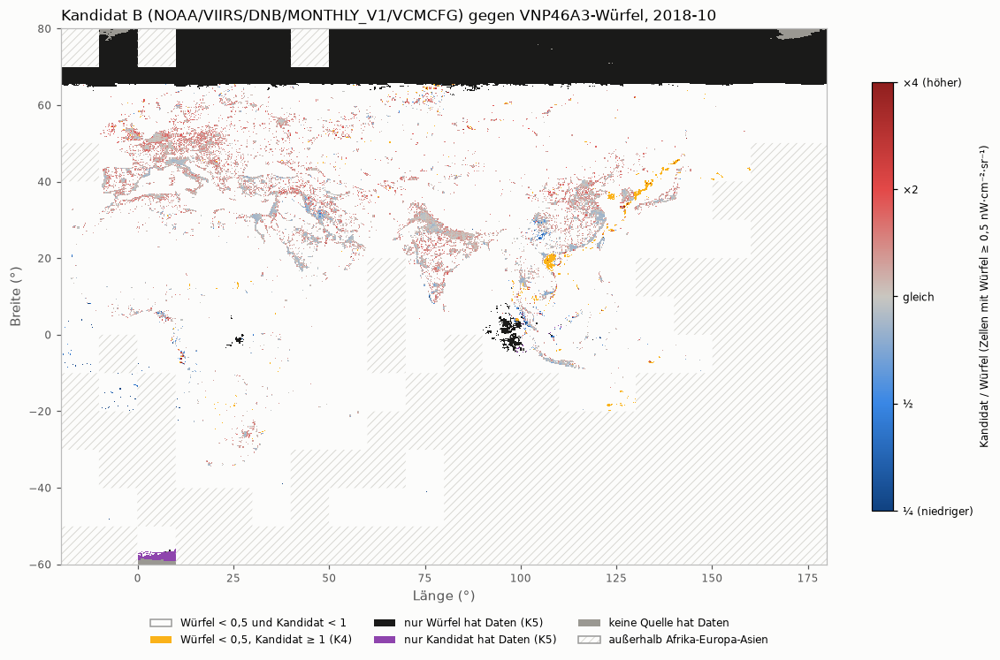

# Machbarkeitsprüfung Google Earth Engine: gleiche Nachtlichtwerte wie der VNP46A3-Würfel?

Stand: 2026-09-27, 19:50 UTC · abgeschlossen für Kandidat B; **Kandidat A offen** · Code: `aleph/core/earth_engine.py`, `aleph/quellenvergleich/ee_nachtlicht.py`

## Kurzfassung

- **Earth Engine läuft:** Anmeldung außerhalb des Repos, Projekt nur in `.env`, Mini-Test geklappt. Nichtkommerzielle Nutzung und das Veröffentlichen von Ergebnissen sind erlaubt. Offen: ob ein Preisgeld als „Vergütung“ zählt.
- **VNP46A3 selbst gibt es in Earth Engine nicht.** Kandidat A (VNP46A2 täglich, nachgebauter Monatswert) kann nur „alle Blickwinkel“. Die Katalogseite beschreibt das Qualitätsfeld veraltet; es gilt die NASA-Tabelle.
- **Kandidat B (EOG VCMCFG), 2018-10, Afrika-Europa-Asien: „teilweise“, also nicht erfüllt.** r = 0,955 (95-%-Intervall 0,933–0,971, K1 nur knapp), Stichproben passen. Verfehlt: K2, ein echter Versatz (Städte q ≈ 0,89, schwache Zellen 1,17–1,25, auch nach fairer Klasseneinteilung). Außerdem K5: nördlich von etwa 65,5° N hat B keine Daten.
- **Kandidat A offen:** Die Rechnung hing nach 185 von 188 Blöcken, drei Anfragen ohne Antwort; der Code hatte kein Zeitlimit. Jetzt eingebaut und getestet. Ein neuer Lauf dauert etwa 50 Minuten.
- **Empfehlung:** B weder als Ersatz noch an der Grenze zu Amerika/Ozeanien verwenden (der Versatz wäre ein Sprung). Als Gegenprobe südlich 60° N *könnte* B taugen; das ist nur eine nachträgliche Untergruppe aus einem Monat, dafür gibt es noch kein Kriterium. Kosten: 1,5 min und 2,4 MB je Monat für die Region.
- Tests: 700/700 grün, keiner übersprungen. statistik-pruefer: „bestanden mit Auflagen“; plausibilitaets-pruefer: „plausibel mit Vorbehalt“; Auflagen eingearbeitet.

## Urteil

- **Kandidat B erfüllt die festgelegten Kriterien nicht** („teilweise“: K1, K3, K4, K6 erfüllt; K2, K5 nicht).
  - Er gibt die Verteilung des Lichts gut wieder. r = 0,955 auf log-Skala. Mit räumlichem Block-Bootstrap liegt das 95-%-Intervall bei 0,933–0,971, K1 ist also nur knapp und nicht sicher erfüllt. In den Klassen mittel und hell weichen nur 2 % der Zellen um Faktor 2 ab.
  - Er ist aber nicht mit dem Würfel austauschbar. Städte (hell) haben q ≈ 0,89 (Intervall 0,876–0,907), schwach beleuchtete Zellen (mittel) 1,17 (1,147–1,195).
    - Der Versatz ist **kein Artefakt der Klasseneinteilung**. Nach dem geometrischen Mittel beider Quellen eingeteilt, bleibt hell bei 0,89, und mittel steigt auf 1,25 (nachträgliche Empfindlichkeitsprüfung, siehe Belege).
  - Im Norden fehlen ihm Daten. Bis 64,5° N hat er zu 98–100 % Daten, zwischen 65,5° und 66° N zu 8 %, ab 66° N gar keine (Oktober 2018; scharfe Kante).
  - Wo der Würfel dunkel ist, zeigt B Licht in 735 Zellen (0,3 %, K4 erfüllt):
    - auf dem Meer (Golf von Tonkin, Gelbes und Japanisches Meer, Golf von Thailand), vermutlich Boote;
    - an Land in Brandgebieten (Nord-Australien, Sahel, südliches Afrika im Oktober), vermutlich Feuer.
  - Evidenzstufe: **beobachtet** für alle Zahlen. Die Ursachen (Verfahrensunterschiede, Streulicht, Boote, Brände) passen zu den Katalogangaben, sind aber nicht einzeln geprüft (**Vermutung**).
- **Kandidat A: kein Urteil möglich.** Die Rechnung hing bei den letzten Blöcken, das Ergebnis ging verloren. Aus dem Probeblock (Berlin: A 14,06 gegen Würfel 14,04) lässt sich nichts verallgemeinern.
- **Kriterien:** unverändert wie um 16:24 UTC festgelegt; im Code als Konstanten, ein Test schützt sie gegen Ändern.
  - Der Zeitpunkt der Festlegung ist nur durch diesen Bericht belegt, nicht durch einen Commit. Der Code war vor dem Rechnen nicht eingecheckt (Hinweis statistik-pruefer).
  - Künftig werden Kriterien vor dem Rechnen committet.

## Belege

### Schritt 1 – Einrichten (Zwischenstand 16:24 UTC)

- **Git-Adresse:** In diesem Repo ist jetzt dauerhaft die anonyme GitHub-Adresse eingestellt (`git config user.email 332095916+rosyan67@users.noreply.github.com`, ohne `--global`). Geprüft: `git config --local --get user.email` liefert genau diese Adresse; die Kennnummer 332095916 stimmt mit der öffentlichen GitHub-API für `rosyan67` überein. Eine globale Adresse ist nicht gesetzt.
- **Paket:** `earthengine-api==1.7.45` mit uv in `.venv` installiert (19 neue Pakete, u. a. `google-api-python-client`, `google-auth`, `google-cloud-storage`); in `requirements.txt` nachgetragen. Die Installation dauerte etwa 30 Minuten, weil die Leitung mit dem NASA-Download geteilt wird.
- **Anmeldung (Zwischenstand 17:17 UTC):** `earthengine authenticate --auth_mode=localhost`, vom Nutzer im Browser bestätigt. Das Token liegt in `~/.config/earthengine/credentials` (außerhalb des Repos, Rechte `-rw-------`). Hinweis: Die Standard-Anmeldung verlangt weite Berechtigungen (Earth Engine, Cloud Platform, **Google Drive**, **Cloud Storage voll**); ALEPH nutzt nur Earth Engine. Wer das einschränken will, kann die Anmeldung mit `--scopes` wiederholen (nicht geprüft, ob Earth Engine dann alles Nötige kann).
- **Schutz vor Zugangsdaten im Repo:** `.gitignore` erfasst jetzt zusätzlich `credentials`, `**/earthengine/`, `*service-account*.json`, `*-key.json`, `client_secret*.json`, `application_default_credentials.json` (geprüft mit `git check-ignore`: alle sechs Muster greifen). `.env` war schon erfasst. Im Repo liegt keine Datei mit „credential“, „key.json“ oder „secret“ im Namen.
- **Cloud-Projekt:** vom Nutzer selbst in `.env` als `EE_PROJECT` eingetragen; `.env.example` hat die leere Zeile `EE_PROJECT=`. Neues Modul `aleph/core/earth_engine.py` lädt den Wert nur zur Laufzeit (wie `io.py`) und ersetzt Fehlermeldungen der Bibliothek durch eine eigene Meldung ohne Projekt-ID oder Token (4 Tests in `tests/test_earth_engine.py`).
- **Mini-Test:** `.venv/bin/python -m aleph.core.earth_engine` → „Earth Engine verbunden. Test 1+1 = 2; VCMCFG-Bilder für 2018-10: 1“ (5,9 s).

### Schritt 1.4 – Nutzungsbedingungen (gelesen 2026-09-27 im Originaltext: https://earthengine.google.com/terms/ „Last modified: September 29, 2022“, https://earthengine.google.com/noncommercial/)

**Was wir dürfen:**
- Earth Engine kostenlos nutzen als „Individual using Earth Engine for noncommercial purposes“ (Nichtkommerzielle Seite) bzw. „Non-Commercial Activities“ (Terms 2.1a).
- Ergebnisse veröffentlichen: „Customer can use data, diagrams, charts, figures created by use of the Services in research or educational publications it authors“ (Terms 2.1d). Eine öffentliche Präsentation und ein öffentliches Repo mit Code und daraus erzeugten Zahlen/Bildern sind damit nach meinem Verständnis gedeckt; ausdrücklich als „Repo“ oder „Hackathon“ steht das nirgends.
- Code gehört uns: „Customer owns all Intellectual Property Rights in … Customer Code“ (Terms 4.1).
- Die **Daten** selbst unterliegen der Lizenz ihres Anbieters, nicht Google: „Third party content (e.g. datasets, images) … may be subject to a separate license“; bei Widerspruch gilt die Anbieterlizenz (Terms 4.4). Für A (NASA: „freely accessible“, Zitierbitte) und B (Colorado School of Mines: „public domain … without restriction on use and distribution“) ist die Weitergabe abgeleiteter Werte laut Katalogseite frei.

**Was wir nicht dürfen:**
- Geld für mit Earth Engine erzeugte Anwendungen oder Daten nehmen: „Receive compensation for applications or data created by the use of Earth Engine“; keine Auftragsarbeit gegen Bezahlung („fee-for-service“); keine Arbeit „on behalf of entities covered by commercial terms“ (Nichtkommerzielle Seite, Abschnitt „Individual“).
- Den Dienst weiterverkaufen, weitergeben oder mehrere Konten als eines ausgeben (Terms 2.2c).
- Google-Marken nur nach den Markenrichtlinien verwenden (Terms, „Publicity“).
- Kostenlos nur bis zur zugeteilten Quote (Terms 2.1f); darüber kann Google Gebühren verlangen.

**Offen, nicht geprüft:** ob ein **Preisgeld** der Space Apps Challenge als „compensation for applications or data created by the use of Earth Engine“ gilt. Das steht in keiner der beiden Seiten; vor einer Einreichung mit Earth-Engine-Ergebnissen sollte das geklärt werden (Challenge-Regeln lesen, im Zweifel Google fragen). Ebenfalls nicht geprüft: die Acceptable Use Policy und die Markenrichtlinien im Einzelnen.

### Katalogprüfung (abgerufen 2026-09-27, 16:18 UTC, Seiten als HTML geladen und als Text gelesen, nicht über eine Zusammenfassung)

| Kandidat | Earth-Engine-Kennung | Katalogseite | Zeitraum laut Katalog |
|---|---|---|---|
| A (täglich, NASA, Version 2 wie unser Würfel) | `NASA/VIIRS/002/VNP46A2` | https://developers.google.com/earth-engine/datasets/catalog/NASA_VIIRS_002_VNP46A2 | 2012-01-19 bis 2026-09-24 |
| A, alte Fassung (Version 1, als „deprecated“ markiert, „superseded by NASA/VIIRS/002/VNP46A2“) | `NOAA/VIIRS/001/VNP46A2` | …/NOAA_VIIRS_001_VNP46A2 | 2012-01-19 bis 2024-12-26 |
| B (monatlich, EOG, ohne Streulicht-Korrektur) | `NOAA/VIIRS/DNB/MONTHLY_V1/VCMCFG` | …/NOAA_VIIRS_DNB_MONTHLY_V1_VCMCFG | 2012-04-01 bis 2026-08-01 |
| B, Variante mit Streulicht-Korrektur | `NOAA/VIIRS/DNB/MONTHLY_V1/VCMSLCFG` | …/NOAA_VIIRS_DNB_MONTHLY_V1_VCMSLCFG | 2014-01-01 bis 2026-08-01 |

- **VNP46A3 selbst liegt nicht in Earth Engine:** Die Seiten `NASA_VIIRS_002_VNP46A3` und `NOAA_VIIRS_001_VNP46A3` antworten mit HTTP 404 (ebenso `NASA_VIIRS_002_VNP46A1` und `NASA_VIIRS_002_VJ146A2`). Deshalb muss der Monatswert für Kandidat A aus Tagesdaten nachgebaut werden.
- **Kandidat A, Bänder laut Katalog:** `DNB_BRDF_Corrected_NTL`, `Gap_Filled_DNB_BRDF_Corrected_NTL`, `DNB_Lunar_Irradiance`, `Latest_High_Quality_Retrieval`, `Mandatory_Quality_Flag`, `Snow_Flag`, `QF_Cloud_Mask` (Bits 6–7: 0 sicher klar, 1 wahrscheinlich klar, 2 wahrscheinlich bewölkt, 3 sicher bewölkt). Pixelgröße „500 meters“. **Kein Band für den Blickwinkel** (Sensor-Zenitwinkel). Nutzungsbedingung laut Seite: „freely accessible; … it is requested that the author cite the datasets“. DOI 10.5067/VIIRS/VNP46A2.002.
- **Widerspruch Katalog ↔ NASA-Originaltext (wichtig):** Die Earth-Engine-Seite von `NASA/VIIRS/002/VNP46A2` beschreibt `Mandatory_Quality_Flag` mit 0 = „High-quality, Persistent“, 1 = „High-quality, Ephemeral“, 2 = „Poor-quality, Outlier, potential cloud contamination“, Wertebereich 0–3. Der NASA-User-Guide Collection 2.0 (Oktober 2024, im PDF-Originaltext gelesen, Tabelle 9, gedruckte S. 16–17) sagt dagegen: 00 = High-quality, 01 = Poor-quality (Outlier, Potential cloud contamination or other issues), 02 = Poor-quality (high solar zenith angle 102–108 degrees), 03 = Lunar eclipse, 04 = Aurora, 05 = Glint, 255 = Fill. Die Katalogseite gibt vermutlich die alte Collection-1-Tabelle wieder. Welche Bedeutung in den Earth-Engine-Daten gilt, wird an echten Werten geprüft (Schritt 3); bis dahin gilt die NASA-Tabelle.
- **Kandidat B, Bänder laut Katalog:** `avg_rad` (nanoWatts/sr/cm², geschätztes Minimum −1,5) und `cf_cvg` („Cloud-free coverages; the total number of observations that went into each pixel“), Pixelgröße 463,83 m. VCMCFG: „Prior to averaging, the DNB data is filtered to exclude data impacted by stray light, lightning, lunar illumination, and cloud-cover.“ Beide Varianten: „Version 1 has NOT been filtered to screen out lights from aurora, fires, boats, and other temporal lights“; eine Trennung von Licht und Hintergrund gibt es nicht. Nutzungsbedingung: „in the public domain and is being provided without restriction on use and distribution“.
- **Schon aus dem Katalog absehbar:** B arbeitet grundsätzlich anders als VNP46A3 (keine Mond-/BRDF-Korrektur, sondern mondhelle Nächte ausgeschlossen; keine Trennung nach Schnee; keine Nullsetzung unter 0,5; negative Werte möglich; Rand des Aufnahmestreifens ausgeschlossen). Eine enge Übereinstimmung ist bei B deshalb nicht zu erwarten; ein Durchfallen hieße „nicht austauschbar“, nicht „schlecht“. Für ALEPHs Zeitraum ab 2013 kommt nur VCMCFG in Frage (VCMSLCFG beginnt 2014).

### VNP46A3-Verfahren im Originaltext (User Guide Collection 2.0, PDF von viirsland.gsfc.nasa.gov, abgerufen 2026-09-27, Text mit pypdf aus dem PDF gezogen und selbst gelesen)

- Abschnitt 2.3, gedruckte S. 5–6: „Monthly and yearly NTL composites (Wang et al., 2022) are generated from daily atmospherically- and lunar-BRDF-corrected NTL radiance … The observations that fall out of the range of Q1 -1.5*IQR and Q3 + 1.5*IQR are identified as outliers and excluded from the NTL composite. … The monthly and yearly NTL composite are then calculated from the mean values of the remaining observations. To remove any residual background noise, the NTL composite values with radiances less than 0.5 nW·cm-2·sr-1 are set to zero. Aurora-contaminated pixels are filled with gap-filled values.“
- Abschnitt 2.1: Der Algorithmus nutzt „all high-quality, cloud-free, atmospheric-, terrain-, snow-, lunar-, and stray light-corrected radiance“.
- **Nicht im User Guide:** welche Tageswerte genau eingehen (nur Qualitätswert 0? auch 02 = hoher Sonnenzenitwinkel?), wie die Wolkenmaske angewandt wird, wie die Quartile berechnet werden (Interpolation), und wie „Snow_Free“ genau abgegrenzt ist (Snow_Flag des Tages?). Diese Punkte sind **nicht nachbaubar, sondern nur annäherbar**; siehe Festlegung in Schritt 3.

### Schritt 2 – Kriterien für „gute Übereinstimmung“ (festgelegt 2026-09-27, 16:24 UTC, bevor irgendein Earth-Engine-Wert berechnet oder angesehen wurde; Commit-Stand davor `4e48620`)

**Vergleichsgröße.** Würfelvariable `allangle_mittel_beobachtet` (AllAngle, schneefrei, Mittel nur über beobachtete, nicht aufgefüllte Pixel, nW·cm⁻²·sr⁻¹). Grund: Kandidat A kann nur „alle Blickwinkel“ nachbauen (kein Winkelband) und keine historische Auffüllung; Kandidat B hat keine Auffüllung. `allangle_mittel` (mit aufgefüllten Pixeln) wird nur zur Information mitgezeigt.

**Vergleichsmenge.** Alle 0,25°-Zellen der Region Afrika-Europa-Asien (Maske aus der Kachelliste, gelesen über `vnp46a3.lies_monate_mit_region`), in denen Würfel **und** Kandidat einen Wert haben; bei K5 alle Zellen der Region.

**Helligkeitsklassen** (nach dem Würfelwert): dunkel < 0,5; mittel 0,5 bis < 5; hell ≥ 5 nW·cm⁻²·sr⁻¹. Die Grenze 0,5 ist die Rauschschwelle von VNP46A3; 5 trennt grob Städte von Dörfern und Streusiedlung (eigene Festlegung, nicht aus der Literatur).

**Kennzahlen und Grenzen** (q = Kandidat / Würfel je Zelle):

| Nr. | Kennzahl | Menge | Grenze für „erfüllt“ | Warum |
|---|---|---|---|---|
| K1 | Pearson-Korrelation von log10(x + 0,1) (Werte unter 0 auf 0 gesetzt) | mittel + hell | r ≥ 0,95 | Die Werte spannen vier Größenordnungen; auf der log-Skala zählen Städte und Dörfer gleich. 0,95 heißt: rund 90 % der Unterschiede zwischen Zellen werden gleich wiedergegeben. |
| K2a | Systematische Abweichung: Median von q | hell und mittel, **je Klasse** | zwischen 0,90 und 1,10 | Ein Versatz über 10 % würde beim Mischen zweier Quellen als Sprung erscheinen. |
| K2b | Typische Abweichung: Median von \|q − 1\| | hell und mittel, je Klasse | ≤ 0,15 | ALEPHs kleinste sicher erkannte Änderung ist etwa Faktor 2 (künstlicher Würfel: ×1,5 nicht gemeldet, ×2 gemeldet, Bericht 2026-09-26). Die typische Quellenabweichung soll klar darunter liegen. |
| K3 | Anteil Zellen mit großer Abweichung: q > 2 oder q < 0,5 | hell und mittel, je Klasse | ≤ 5 % | Eine Abweichung um Faktor 2 ist so groß wie eine echte Anomalie; sie darf nur selten vorkommen. |
| K4 | Anteil dunkler Würfelzellen, in denen der Kandidat ≥ 1,0 zeigt | dunkel | ≤ 2 % | Falsches Licht in dunklen Gebieten (Wüste, Meer) erzeugt Scheinmeldungen. |
| K5 | Übereinstimmung der Lücken: Zelle „hat Daten“ = mindestens ein beobachteter Pixel (Würfel: `allangle_beobachtete_pixel` > 0; A: mindestens ein Pixel mit mindestens einer gültigen Nacht; B: mindestens ein Pixel mit `cf_cvg` ≥ 1) | alle Zellen der Region | gleicher Zustand in ≥ 95 % der Zellen **und** „Würfel hat Daten, Kandidat nicht“ in ≤ 5 % der Würfel-Datenzellen | Lücken an anderen Stellen verschieben, welche Zellen überhaupt bewertet werden. |
| K6 | Stichproben (Zelle, in der der Punkt liegt): Berlin 52,52° N 13,40° O; Paris 48,86° N 2,35° O; Kairo 30,04° N 31,24° O; Lagos 6,46° N 3,39° O; Delhi 28,61° N 77,21° O; Sahara 25,0° N 25,0° O (Große Sandsee, Ägypten/Libyen) | 6 Zellen | Städte: q zwischen 0,67 und 1,5; Sahara: beide < 0,5 | Einzelne bekannte Orte als Plausibilitätsanker, auch für die Präsentation. |

**Urteil je Kandidat:** „erfüllt“ nur, wenn K1–K6 alle erfüllt sind. „Teilweise“: K1 und K6 erfüllt, mindestens eine andere Kennzahl nicht. Sonst „nicht erfüllt“. Diese Grenzen werden nach dem Rechnen nicht geändert.

**Meine eigene Einschätzung der Grenzen (vorab, ohne Daten):**
- K2b und K3 sind für die Klasse „mittel“ (0,5–5) streng: Dort liegt ein großer Teil der Werte nahe der Nullsetzungs-Schwelle von VNP46A3; kleine Unterschiede in der Nullsetzung einzelner Pixel ergeben große relative Abweichungen. Ein Durchfallen dort ist weniger schwer als in „hell“.
- K1 allein wäre zu schwach: Auch eine Quelle mit Faktor-2-Fehlern in jeder zehnten Zelle kann auf der log-Skala r ≈ 0,95 erreichen. Deshalb K2/K3.
- Die Grenzen sind für den Zweck „austauschbar innerhalb einer Zeitreihe“ gewählt. Für den Zweck „unabhängige Gegenprobe“ reichen schwächere Werte; dafür ist kein eigenes Kriterium festgelegt.

### Schritt 3 – Vergleich (Zwischenstand 17:30 UTC)

**Vergleichsmonat 2018-10.** Im Würfel sind 2018-01 bis 2018-10 für Afrika-Europa-Asien vollständig (Zustand 4, Stufe-1-Nachweis wird beim Lesen geprüft). Warum Oktober:
- Winter (November bis März) scheidet aus (Schnee).
- April: auf der Nordhalbkugel oft noch Schnee (Russland, Skandinavien, Hochgebirge).
- Mai bis August: kurze oder fehlende Nächte nördlich etwa 55° N (Sonnenzenitwinkel < 102°, siehe Steckbrief Abschnitt 8); September: Übergang.
- Oktober: lange Nächte bis in den hohen Norden, kaum Schnee, in Südasien nach dem Monsun (wenig Wolken).
- 2018-10 wurde in einem Zug vollständig geladen (Status: 188 Kacheln, 0 verworfen, 0 Wiederholungen), nicht aus einem abgebrochenen Versuch fortgesetzt.
Die Wahl beruht nur auf Jahreszeit und Ladezustand, nicht auf Werten.

**Technische Befunde vor dem Rechnen** (echte Earth-Engine-Werte, 2018-10-10, Europa/Afrika, Stichprobe im 5-km-Raster):
- `Mandatory_Quality_Flag` hat die Werte 0, 1, 2 **und 5** (Glint). Wert 5 gibt es nur in der NASA-Tabelle (0–5), nicht in der Tabelle der Katalogseite (0–3). **Es gilt die NASA-Tabelle**; die Katalogseite ist in diesem Punkt veraltet.
- Unter den Pixeln mit Qualitätswert 0 sind 857 044 von 857 065 (≈ 100 %) in der Wolkenmaske „sicher klar“; der Wolkenfilter wirkt also praktisch nicht zusätzlich.
- Raster: VNP46A2 liegt in Earth Engine in EPSG:4326 mit 1/240° und Kanten bei −180° / 80° N, also **pixelgenau** auf dem VNP46A3-Raster (60 × 60 Pixel = 1 Zelle). VCMCFG: ebenfalls 1/240°, aber um einen halben Pixel verschoben (Kante −180,0021° / 75,0021° N) und nur bis 75° N.

**Verfahren** (Code `aleph/quellenvergleich/ee_nachtlicht.py`, Raster aus `aleph.layers.vnp46a3` gelesen und gegen die Zellmitten geprüft):
- A: Tageswert `DNB_BRDF_Corrected_NTL`, nur Qualität 0, Schnee 0, Wolke „klar/wahrscheinlich klar“, Nacht; je Pixel Tukey-Ausreißer entfernt (Earth-Engine-Perzentile 25/75), Mittel, < 0,5 → 0; Pixel ohne Nacht = keine Daten.
- B: `avg_rad`, nur Pixel mit `cf_cvg` ≥ 1.
- Beide: in Earth Engine flächengewichtetes Mittel über die Pixel mit Daten je 0,25°-Zelle (`reduceResolution`, dann `reproject` auf das Würfelraster; der Würfel selbst mittelt ungewichtet über die 60 × 60 Pixel, bei 0,25° unter 1 % Unterschied), dazu Anteil Pixel mit Daten; geladen je 10°-Kachel der Region (188 Blöcke à 40 × 40 Zellen) mit `computePixels`, 6 Anfragen gleichzeitig. Auf der SSD unter `vergleich/earth_engine/2018-10_<A|B>.npz`.
- Nicht nachbaubar (A): Blickwinkelklassen, welche Qualitätswerte NASA zulässt, Quartil-Rechenweise, Auffüllung. **Zusätzliche Annahmen (A), nicht aus dem User Guide:** erst Qualitäts-/Schneefilter, dann Tukey; Monatsabgrenzung nach dem UTC-Datum der Tagesbilder in Earth Engine; die Earth-Engine-Kopie von VNP46A2 entspricht der LAADS-Fassung (nicht verglichen). B: gar nicht als Nachbau gedacht.
- Earth-Engine-Rechenwege (`kandidat_a`, `kandidat_b`, `auf_raster`) sind nicht offline getestet, nur am Probeblock Berlin und am Ergebnis B.
- Randeffekt bei B: Durch den halben Pixel Versatz genügt ein Pixel, der eine Zelle nur am Rand anschneidet, damit sie „Daten hat“. Das begünstigt B bei K5 leicht.

**Messung Rechenzeit und Datenmenge 2018-10:**

| | Blöcke | Zeit (verstrichen) | Summe der Anfragezeiten | übertragen | Fehler / Wiederholungen |
|---|---|---|---|---|---|
| B | 188 | 92 s | 540 s | 2,4 MB | 0 / 0 |
| A | 188 | **abgebrochen** (siehe unten); bis Block 160: 2 452 s | nicht erfasst | nicht erfasst (geschätzt wie B: 13 KB je Block, Probeblock) | hing bei den letzten 3 Blöcken |

Probeblock vorab (10–20° O, 50–60° N): A 68,6 s, B 2,8 s, je 13 KB.

**Was mit A passiert ist** (Zeiten UTC):
- 17:25 Start im Hintergrund, direkt nach B. Fortschrittsmeldungen: 20 Blöcke nach 198 s, 160 nach 2 452 s (etwa 18:06), also etwa 15 s je Block bei 6 gleichzeitigen Anfragen.
- Um 18:36 habe ich den Lauf **fälschlich für beendet gehalten**. `ps aux` kürzt lange Befehlszeilen, deshalb fand meine Suche den Prozess nicht. Die Ausgabedatei stand still, weil `grep` die Ausgabe puffert. Daraufhin habe ich einen zweiten Lauf gestartet (mit Zwischenspeicherung je Block, `nohup`). Nach 27 s habe ich den Irrtum bemerkt und den zweiten Lauf beendet; er hatte noch keinen Block geliefert.
- Zustand des ersten Laufs um 18:39–18:52:
  - 0 % Rechenlast.
  - 3 Verbindungen zu Google offen (ESTABLISHED), 3 vom Server geschlossen. Also waren noch 3 Blöcke unterwegs, 185 waren fertig.
  - In 60 s ist auf keiner Verbindung ein Byte geflossen (`nettop`).
  - Die 3 Anfragen liefen seit über 40 Minuten; ein normaler A-Block braucht 60–70 s.
- **Ursache:** Die drei letzten Anfragen bekamen keine Antwort. Ob Google sie verworfen hat oder die Verbindung unterwegs abgerissen ist, lässt sich von hier nicht feststellen. Weil `computePixels` ohne Zeitlimit lief, hätte der Prozess unbegrenzt gewartet.
  - Evidenz: beobachtet (Verbindungen, 0 Byte). Die Ursache auf Googles Seite ist nicht belegt.
- 18:52 beendet (Rückgabewert 144 = mein Signal). Die 185 fertigen Blöcke lagen nur im Speicher und sind verloren.
- **Behoben im Code:**
  - `ANFRAGE_ZEITLIMIT_SEKUNDEN = 600` über `ee.data.setDeadline`. Geprüft: Mit 1 ms bricht die Bibliothek sofort ab („connect timeout=0.001“), mit 600 s läuft ein Block in 5 s.
  - Jeder fertige Block wird sofort auf der SSD abgelegt und bei einem Neustart übernommen.
  - Ein Lauf mit fehlenden Blöcken schreibt kein Ergebnis (sonst sähen fehlende Blöcke wie „keine Daten“ aus).
  - Dazu 2 neue Tests.

**Ergebnis B (VCMCFG) gegen `allangle_mittel_beobachtet`: „teilweise“** (K1, K3, K4, K6 erfüllt; K2 und K5 nicht)

| Kennzahl | Wert | Grenze | erfüllt |
|---|---|---|---|
| K1 r (log, mittel + hell, 15 132 Zellen) | 0,955 | ≥ 0,95 | ja (knapp) |
| K2 Median q hell (2 043 Zellen) / mittel (13 089) | 0,89 / 1,17 | 0,90–1,10 | **nein** |
| K2 Median \|q−1\| hell / mittel | 0,12 / 0,19 | ≤ 0,15 | **nein** (mittel) |
| K3 Anteil Faktor 2 hell / mittel | 2,3 % / 2,0 % | ≤ 5 % | ja |
| K4 falsches Licht im Dunkeln (238 631 Zellen) | 0,3 % | ≤ 2 % | ja |
| K5 gleicher Lückenzustand / Würfel ja, B nein | 84,6 % / 15,3 % | ≥ 95 % / ≤ 5 % | **nein** |
| K6 Stichproben | Berlin 0,95; Paris 0,91; Kairo 0,83; Lagos 0,90; Delhi 0,83; Sahara 0,00 / 0,22 | 0,67–1,5; < 0,5 | ja |

- Mit `allangle_mittel` (mit aufgefüllten Pixeln) praktisch gleich (r 0,956, gleiche Kriterien verfehlt).
- **Wo die Lücken abweichen** (Anteil Zellen mit Daten, Würfel / B): 75–80° N 0,95 / 0,00 (VCMCFG endet bei 75° N); 60–75° N 1,00 / 0,38 (vermutlich Streulicht-Ausschluss im Oktober, laut Katalog „filtered to exclude data impacted by stray light“; Ursache nicht einzeln geprüft); 60° N bis 40° S ≥ 0,99 / ≥ 0,99. Die Lückenabweichung ist also fast ganz ein Breitenproblem.
- Deutung (nicht Teil des Urteils): B ist in Städten etwa 10–17 % dunkler (Kairo, Delhi 0,83), in mittleren Zellen etwa 17 % heller. Das passt zu den Unterschieden im Verfahren:
  - B setzt Werte unter 0,5 nicht auf 0; der Hintergrund hebt schwache Zellen an.
  - B hat keine Winkel- und Mondkorrektur.
  Einzeln bewiesen ist das nicht.
- **Zusatzauswertung nach Breite** (nach dem Rechnen angesehen, **nicht Teil des Urteils**, die Kriterien bleiben):

  | Teil der Region | r | Median q hell / mittel | Anteil Faktor 2 hell / mittel | Lücken gleich | erfüllt (ohne K6) |
  |---|---|---|---|---|---|
  | südlich 60° N | 0,957 | 0,89 / 1,17 | 2,1 % / 1,9 % | 99,6 % | K1, K3, K4, K5; **nicht K2** |
  | 60–75° N | 0,91 | 0,92 / 1,31 | 11,8 % / 8,0 % | 38 % | nur K4 |

  Die Grenze 60° N habe ich erst nach Ansicht der Lückenkarte gewählt. Dass die Lücken südlich davon zu 99,6 % übereinstimmen, ist deshalb teilweise ein Zirkelschluss (Hinweis statistik-pruefer). Genauer zeigt sich eine **scharfe Kante**: B hat Daten bei 60–64,5° N zu 98–100 %, bei 65–65,5° N zu 69 %, bei 65,5–66° N zu 8 %, ab 66° N nirgends.

- **Empfindlichkeitsprüfung Klasseneinteilung** (nachträglich, nicht Teil des Urteils). Klassen nach dem Würfelwert allein erzeugen eine Regression zur Mitte: Auch ohne Versatz erschienen helle Zellen beim Kandidaten dunkler und schwache heller (am künstlichen Beispiel im Test `test_auswahleffekt_bei_reinem_rauschen_und_gegenmittel` gezeigt). Eingeteilt nach dem geometrischen Mittel beider Quellen:

  | Klasse (nach √(Würfel·B)) | Zellen | Median q | Median \|q−1\| | Anteil Faktor 2 |
  |---|---|---|---|---|
  | hell (≥ 5) | 1 955 | 0,89 | 0,12 | 1,4 % |
  | mittel (0,5–5) | 16 143 | 1,25 | 0,26 | 6,3 % |

  Der Versatz bleibt, bei mittel wird er sogar größer. Er ist also überwiegend echt.
- **Unsicherheit** (räumlicher Block-Bootstrap, 10°-Kacheln als Blöcke, 139 Blöcke, 1 000 Wiederholungen, nachträglich): r 0,933–0,971; Median q hell 0,876–0,907, mittel 1,147–1,195; Median \|q−1\| hell 0,104–0,130, mittel 0,173–0,211. K1 ist damit nicht sicher erfüllt, K2 klar nicht.

- **Falsches Licht im Dunkeln (K4, erfüllt mit 0,3 %):** 735 Zellen, grobe Rechtecke:
  - 122 im Golf von Tonkin (17–21° N, 105–110° O);
  - 124 im Gelben und Ostchinesischen Meer bzw. um Korea;
  - 133 im Japanischen Meer, der hellste Fleck bei 39° N, 133° O (Yamato-Bank, laut plausibilitaets-pruefer ein Fanggebiet mit Lichtfang, nicht an der Literatur geprüft);
  - 34 im Golf von Thailand;
  - an Land 28 in Nord-Australien und 42 im tropischen Afrika (Sahel, Sambia/Angola), dazu vereinzelt Westsibirien.
  Deutung (Vermutung): Boote und Brände. Laut Katalog filtert VCMCFG „boats“ und „fires“ nicht; Oktober ist Brandsaison in Nord-Australien und im südlichen Afrika. Für eine Gegenprobe reicht es deshalb nicht, Meereszellen auszunehmen.
- **Weitere Lücken:**
  - Bei Sumatra haben 430 Zellen nur im Würfel Daten, im Kongobecken 47. Der Würfel ist dort im Median nur zu etwa 69 % beobachtet (rund 2 470 von 3 600 Pixeln). Vermutung: Wolken zusammen mit dem Ausschluss mondheller Nächte bei B. Der Würfel korrigiert Mondlicht, statt die Nacht auszuschließen.
  - 326 der 344 Zellen, in denen nur B Daten hat, liegen im Südpolarmeer (56–59° S, 0–10° O). Vermutung: Meereis. Der Würfel ist schneefrei zusammengesetzt, B trennt nicht.
- **Stichproben sind grobe Anker:** Berlin (52,52° N) liegt am Südrand seiner Zelle; die Zelle zeigt vor allem Nord-Berlin und Umland. Andere Städte weichen stärker ab als die sechs vorab gewählten: Kinshasa 0,61, Oslo 0,70, Reykjavík 0,45 (Werte vom plausibilitaets-pruefer nachgerechnet).
- **Abweichungskarte B:** `berichte/bilder/2026-09-27_ee_abweichung_2018-10_B.png`

  

  Ausschnitt: 80° N bis 60° S, 20° W bis 180° O (die ganze Region).
  - Blau: B niedriger, rot: B höher (Zellen mit Würfel ≥ 0,5 nW·cm⁻²·sr⁻¹, gekappt bei Faktor 4); grau in der Mitte: gleich.
  - Weiß: Würfel < 0,5 und B < 1. Gelb: Würfel < 0,5, B ≥ 1.
  - Schwarz: nur der Würfel hat Daten. Violett: nur B hat Daten. Mittelgrau: keine Quelle hat Daten.
  - Schraffiert: außerhalb der Region.
- Eine Karte für A gibt es nicht (A offen).

### Schritt 4 – Folgen für ALEPH

**Amerika/Ozeanien aus Earth Engine, Afrika-Europa-Asien aus dem Würfel (Bruch an der Grenze):**
- Mit B: nicht empfehlenswert.
  - Der Versatz (Städte −11 %, mittlere Zellen +17 %) wäre an der Grenze ein Sprung, obwohl dort nichts passiert.
  - ALEPH vergleicht zwar je Zelle nur mit derselben Zelle früherer Jahre; solange eine Zelle immer aus derselben Quelle kommt, stört der Versatz die Anomalie- und Trenderkennung nicht direkt.
  - Aber alle Vergleiche **über** die Grenze würden verzerrt: Länder- und Kontinentsummen, Rangfolgen, Karten mit einer gemeinsamen Farbskala, Verknüpfung mit der Weltbank.
  - Außerdem fehlen B im Norden Kanadas und Alaskas vermutlich dieselben Daten wie in Sibirien (Streulicht). Das habe ich nicht geprüft, weil die Region nicht verglichen wurde.
  - Und in jeder Darstellung müsste stehen, welche Zellen aus welchem Produkt stammen.
- Mit A: nicht beurteilbar (offen). Auch bei guter Übereinstimmung bliebe eine Einschränkung: Aus VNP46A2 lässt sich nur AllAngle bilden, NearNadir (die Gegenprobe im Würfel) nicht.
- **Alternative „alles zusätzlich aus Earth Engine als Gegenprobe“:** Mit B sinnvoll und billig, wenn sie ausdrücklich als zweites, unabhängiges Produkt geführt wird. Zwei Beispiele:
  - Eine Anomalie im Würfel, die B nicht zeigt, bekommt einen Hinweis.
  - Ein Einbruch in beiden Produkten ist belastbarer.
  - Grenzen: südlich etwa 64° N; Meereszellen (Boote) und Brandzellen kennzeichnen (z. B. mit FIRMS, das ohnehin geplant ist).

**Hochrechnung aller 156 Monate** (lineare Hochrechnung aus **einem** Monat; Quote, Gleichzeitigkeit über 6 und Hänger nicht geprüft):

| | je Monat, Region (188 Kacheln) | je Monat, alle 540 Kachelpositionen | 156 Monate, alle | 156 Monate, nur Amerika/Ozeanien (352) | Daten, 156 Monate alle |
|---|---|---|---|---|---|
| B | 92 s | etwa 4,4 min | etwa 11–12 h | etwa 7–8 h | etwa 1,1 GB (unkomprimiert, NPY) |
| A | etwa 48 min (aus 15 s je Block bis Block 160) | etwa 2,3 h | etwa 15 Tage ohne Pause | etwa 10 Tage | etwa 1,1 GB |

- Zum Vergleich: Der NASA-Download braucht laut Status noch bis etwa 22.10.–03.11.2026 für alles. A über Earth Engine wäre also nicht schneller als der Download.
- B wäre in einem halben Tag fertig; B wird im Katalog bis 2026-08 fortgeführt.
- Bei A kommt das Risiko von Hängern dazu; das Zeitlimit von 600 s begrenzt sie jetzt.

**Niederschlag und Vegetation in Earth Engine** (Katalogseiten abgerufen 2026-09-27, 17:24 UTC; nur geprüft, ob es sie gibt):
- **IMERG:**
  - `NASA/GPM_L3/IMERG_MONTHLY_V07` (monatlich; laut Katalog 1998-01 bis 2025-09, 11 132 m).
  - `NASA/GPM_L3/IMERG_V07` (halbstündlich; 1998-01 bis 2026-09-26).
  - Achtung: Die Monatsfassung reicht laut Katalog nur bis 2025-09; für ALEPHs Zeitraum bis 2025-12 fehlen dort drei Monate. Die halbstündliche Fassung deckt ihn ab.
- **NDVI:** Das in ARCHITECTURE.md geplante `MOD13C2` (0,05°, monatlich) gibt es in Earth Engine **nicht** (`MODIS/061/MOD13C2`: HTTP 404). Vorhanden sind:
  - `MODIS/061/MOD13A3` (monatlich, 1 km, 2000-02 bis 2026-08);
  - `MODIS/061/MOD13A2` (16 Tage, 1 km).
- Nicht geprüft: Bänder, Qualitätsfelder, Nutzungsbedingungen dieser Datensätze, und ob sie dieselben Werte liefern wie die NASA-Originale.

### Prüfer

- **statistik-pruefer** (über Schritt 2 und 3): **„bestanden mit Auflagen“.** Kriterien im Code wie im Bericht, keine Abweichung. Auflagen und Umsetzung:
  1. Auswahl-Effekt durch Klassen nur nach dem Würfelwert → Empfindlichkeitsprüfung mit geometrischem Mittel gerechnet; der Versatz bleibt. Formulierung „folgt aus dem Verfahren“ ersetzt durch Vermutung.
  2. Nachträgliche 60°-N-Untergruppe nicht als „brauchbar“ verkaufen → Kurzfassung und Empfehlung abgeschwächt, Zirkelschluss benannt.
  3. Festlegezeitpunkt nicht per Commit belegbar → im Urteil vermerkt; künftig vor dem Rechnen committen.
  4. Unsicherheit fehlte → räumlicher Block-Bootstrap ergänzt (`block_bootstrap`).
  5. Maske würde bei Zustand 1 die ganze Welt zählen → `lies_wuerfel` verknüpft jetzt mit `region_maske()`, Test ergänzt; das Urteil für 2018-10 ist unverändert (neu gerechnet).
  6. Bericht präzisiert: „flächengewichtet“ nur in Earth Engine; Randeffekt bei K5; drei unmarkierte Annahmen von A; Datenmenge A geschätzt.
  7. Tests ergänzt: Auswahl-Effekt bei reinem Rauschen, negative Kandidatenwerte, NaN in Stichprobenzelle, Maske bei Zustand 1, Bootstrap.
  8. Doppelte Abschnitte und Platzhalter entfernt.
- **plausibilitaets-pruefer**: **„plausibel mit Vorbehalt“.** Alle Stichproben und Summen nachgerechnet und bestätigt, Rangfolge stimmig (Seoul 35 gegen Pjöngjang 0,58; Kairo 44 gegen Khartum 2,4; Wüsten nahe 0 im Würfel, 0,2–0,35 in B). Vorbehalte und Umsetzung:
  1. Nordlücke ist eine scharfe Kante bei etwa 65,5° N → von mir nachgerechnet und so beschrieben.
  2. Falsches Licht auch an Land (Brände) und größte Häufung Golf von Tonkin → nachgerechnet (122 Zellen) und ergänzt.
  3. Sumatra/Kongo: Wolken allein erklären es nicht → Deutung um mondhelle Nächte ergänzt (Vermutung).
  4. Karte schnitt 40–60° S ab (326 Zellen nur in B, Südpolarmeer) → Karte zeigt jetzt die ganze Region.
  5. Legende „dunkel“ ungenau, Mitte „gleich“ kaum von Weiß zu unterscheiden, Einheit gekürzt → Legende präzisiert, Mitte dunkler grau, volle Einheit.
  6. Schwarz sagte nicht, welche Quelle fehlt → jetzt schwarz = nur Würfel, violett = nur B, grau = keine.
  7. Stichproben am Zellrand; größere Streuung anderer Städte → ergänzt.
  8. Platzhalter → entfernt.
  9. 2018-04 prüft vor allem Schnee → in Empfehlung vermerkt.
  - Hinweis: Die Datei `.claude/agents/plausibilitaets-pruefer.md` beginnt ohne die Kopfzeile `---`. Vermutlich wird sie deshalb von Claude Code nicht als Agent erkannt; sie stand in dieser Sitzung nicht zur Auswahl. Ich habe einen allgemeinen Agenten mit genau dieser Rollenbeschreibung eingesetzt, nur lesend. Die Datei selbst habe ich nicht geändert.
- **Tests:** vollständige Suite nach allen Änderungen: `.venv/bin/python -m pytest -q -rs` → **700 passed**, keine Zeile „SKIPPED“ (408 s). Die Tests mit echten Daten (SSD) liefen mit. Danach nur noch `_r` so geändert, dass eine Klasse mit lauter gleichen Werten „nicht bestimmbar“ ergibt statt einer NumPy-Warnung; Ergebnis B unverändert (r 0,9553), letzte vollständige Suite danach: 700 passed, 0 übersprungen.

## Umfang

- **Neu:**
  - `aleph/core/earth_engine.py` (Anmeldung, Projekt aus `.env`)
  - `aleph/quellenvergleich/__init__.py`, `aleph/quellenvergleich/ee_nachtlicht.py` (Kandidaten, Zusammenfassung auf das Raster, Laden mit Zeitlimit und Zwischenspeicherung, Vergleich K1–K6, nachträgliche Zusatzprüfungen `klassen_nach_beiden` und `block_bootstrap`, Karte)
  - `tests/test_earth_engine.py` (4), `tests/test_quellenvergleich_ee.py` (18)
  - dieser Bericht und die Karte unter `berichte/bilder/`
- **Geändert:**
  - `requirements.txt` (`earthengine-api==1.7.45`)
  - `.env.example` (`EE_PROJECT=`)
  - `.gitignore` (Muster für Google-Zugangsdaten)
  - `.git/config` des Repos (`user.email` = noreply-Adresse)
- **Auf der SSD:**
  - `vergleich/earth_engine/2018-10_B.npz` (Zellwerte B, 1,0 MB)
  - der leere Zwischenordner `2018-10_A_bloecke/` vom beendeten zweiten A-Lauf
- **Außerhalb des Repos:** `~/.config/earthengine/credentials` (Token), neue Pakete in `.venv`, ein Hilfs-venv für pypdf nur im Sitzungs-Notizordner.
- **Nicht angefasst:**
  - Download (Prozess 82367, Ampel OK um 18:37 UTC)
  - `aleph/layers/vnp46a3*.py`, Kachellisten, `scripts/`
  - der Würfel wurde nur gelesen, über `vnp46a3.lies_monate_mit_region`
  - `.env` wurde nicht gelesen; das Projekt lädt der Code zur Laufzeit
- **Zeitraum:** nur 2018-10 (und 2018-10-10 für die Qualitätswert-Stichprobe). Keine Daten aus 2023–2025; der Code verweigert Monate ab 2023-01 (Test).
- **Netz:**
  - Earth-Engine-Anfragen: zwei volle Läufe, einer davon abgebrochen, dazu Probeblöcke.
  - Abrufe von Katalog- und Bedingungsseiten, des NASA-User-Guides (PDF, 1,5 MB), der GitHub-API (öffentliche Nutzerkennung) und von PyPI.
  - An keinen Dienst ging eine E-Mail-Adresse.

## Empfehlung

1. **B nicht als Ersatz** für fehlende VNP46A3-Monate oder -Regionen verwenden. Wenn der NASA-Download rechtzeitig fertig wird (Status: 22.10.–03.11.), gibt es keinen Grund dafür.
2. **B als unabhängige Gegenprobe erwägen** (eigener Layer „Nachtlicht EOG“, südlich 60° N, Meereszellen gekennzeichnet). Vorher datenquellen-scout (CLAUDE.md) und ein zweiter Vergleichsmonat. Der zweite Monat darf **nicht** nach dem Ergebnis ausgesucht werden: Vorschlag 2018-04 (Frühjahr), festgelegt jetzt. Der April prüft vor allem die Schneebehandlung (Hinweis plausibilitaets-pruefer); das ist gewollt. Vorher ein eigenes Kriterium für „Gegenprobe“ festlegen und **vor** dem Rechnen committen.
3. **A nur weiterverfolgen, wenn es einen Bedarf gibt,** z. B. als Notfallweg, falls die Suomi-NPP-Monatsdaten nach dem 1.11.2026 nicht mehr abrufbar sind. Dann A für 2018-10 mit dem reparierten Code neu rechnen (etwa 50 Minuten) und mit denselben Kriterien bewerten. Als Ersatz für den Download ist A zu langsam (etwa 15 Tage für alles).
4. **Vor jeder Einreichung mit Earth-Engine-Ergebnissen klären,** ob ein Preisgeld der Challenge als „compensation“ gilt (Nichtkommerzielle Bedingungen).
5. **Anmeldung einschränken (optional):** Das Token hat Zugriff auf Google Drive und Cloud Storage. Wer das nicht will, meldet sich mit engeren `--scopes` neu an; ob Earth Engine dann noch alles kann, ist nicht geprüft.
6. **Earth-Engine-Katalog nicht blind übernehmen:** Die Tabelle zum Qualitätsfeld von VNP46A2 ist dort veraltet. Für jede Earth-Engine-Quelle die Anbieterdokumentation gegenlesen.

## Nicht geprüft

- **Kandidat A insgesamt** (kein vollständiges Ergebnis). Außerdem:
  - ob NASA für VNP46A3 auch Tageswerte mit Qualitätswert 02 (hoher Sonnenzenitwinkel) zulässt;
  - wie NASA die Quartile rechnet;
  - wie „Snow_Free“ im Monatsprodukt genau abgegrenzt ist.
- Warum die drei letzten A-Anfragen keine Antwort bekamen (Google oder Netz).
- Grenzen und Quote von Earth Engine für nichtkommerzielle Konten (Anfragen gleichzeitig, Rechenzeit). Die Seite `cloud.google.com/earth-engine/docs/earth-engine-limits` ist heruntergeladen, aber nicht gelesen.
- Ein zweiter Monat, andere Jahreszeiten, die Regionen Amerika/Ozeanien (dort gibt es im Würfel noch keine Daten).
- Ob die Streulicht-Lücken von B im Norden jeden Sommer und Herbst auftreten; die Variante VCMSLCFG (mit Streulicht-Korrektur, erst ab 2014) wurde nicht gerechnet.
- Ob die gelben Meereszellen wirklich Boote sind.
- Die Acceptable Use Policy und die Markenrichtlinien von Google; die Space-Apps-Regeln zu Preisen.
- IMERG und MOD13A3 in Earth Engine inhaltlich (nur die Existenz geprüft).

