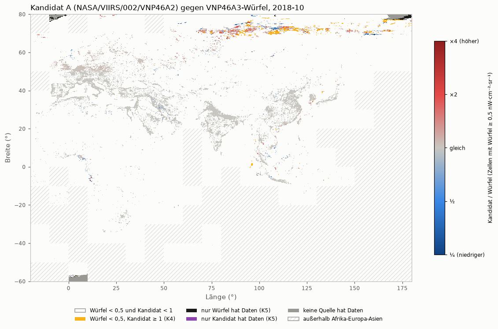

# Earth Engine A: Agenten-Kopfzeilen, Zeitlimit-Regel, engere Anmeldung, Kandidat A

Stand: 2026-09-28, 10:30 UTC

## Kurzfassung

- **Kandidat A (VNP46A2 in Earth Engine, Monatswert nachgebaut), 2018-10, Afrika-Europa-Asien: „erfüllt“** (K1–K6). Südlich von 55° N praktisch deckungsgleich mit dem Würfel (typisch 0,2–0,3 % Abweichung); 55–60° N ist eine Übergangszone mit etwa 4 % Versatz. Evidenz: beobachtet, ein Monat.
- **Geltungsgrenze:** Nur südlich von 55° N belastbar. Nördlich von etwa 65° N weichen A und Würfel deutlich voneinander ab, auch in Städten (Norilsk ×1,7). Welche Quelle dort falsch liegt, ist offen. A ist ein **Ersatz aus denselben Rohdaten, keine unabhängige Bestätigung**.
- **Agenten:** plausibilitaets-pruefer und layer-bauer wurden wegen fehlender `---`-Zeile nicht erkannt; repariert, alle fünf in einer frischen Sitzung erkannt. Modelle: Prüfer `opus`, übrige `sonnet` (Feld und Werte laut Claude-Code-Doku).
- **Netzwerkregel** in CLAUDE.md. Earth-Engine-Start und Unpaywall bekamen Zeitlimit bzw. Wiederholung; alle Wiederholungen werden gemeldet. Ohne Zeitlimit bleiben NASA-Katalogabfrage (gesperrte Datei) und GPM IMERG: nur Empfehlung.
- **Earth Engine nur noch mit Lese-Recht** (`earthengine.readonly`, laut REST-Referenz ausreichend; von Google bestätigt). Kein Drive-Zugriff mehr, altes Token widerrufen. Mini-Test und Download klappen.
- Tests 713/713 grün. statistik-pruefer „bestanden mit Auflagen“, plausibilitaets-pruefer „plausibel mit Vorbehalt“; Auflagen eingearbeitet.

## Urteil

- **Kandidat A erfüllt die vorab festgelegten Kriterien** für 2018-10 in Afrika-Europa-Asien. Das folgt laut statistik-pruefer korrekt aus der Regel. K1 und K2 liegen auch im Bootstrap-Intervall weit innerhalb der Grenzen.
- **Was das Urteil deckt:** Das Urteil ist ein Durchschnitt über die ganze Region; der Süden stellt die Mehrheit der Zellen. Belastbar ist es **südlich von 55° N**. Dort ist der Nachbau praktisch deckungsgleich (Median \|q−1\| 0,2–0,3 %, Faktor 2 bei 0–3,3 % der Zellen je Breitenband).
- **Was es nicht deckt** (nachträglich ausgewertet, Grenzen nach Ansicht der Karte gewählt, also beschreibend):
  - Nördlich von etwa 65° N weichen A und Würfel deutlich voneinander ab: Median q 1,03–1,27, 7–17 % der Zellen um Faktor 2. Dort liegen fast alle Zellen mit falschem Licht. Zwischen 55° und 65° N ist A etwa 4–5 % heller (Median \|q−1\| 0,05–0,08), eine Übergangszone.
  - Bei fairer Klasseneinteilung (geometrisches Mittel) liegen in „mittel“ 8,1 % der Zellen um Faktor 2 daneben (über der K3-Grenze von 5 %). Das ist **dasselbe Nordproblem**: südlich 60° N 0,7 %, nördlich 31,7 %.
  - Nur ein Monat, ein Oktober. Im Oktober stören im Norden lange Nächte, Polarlicht und erster Schnee, im Sommer fehlen dort die Nächte ganz. Das Ergebnis lässt sich deshalb nicht auf andere Monate übertragen, gerade im Norden nicht.
  - A kann nur AllAngle nachbauen, nicht NearNadir (kein Blickwinkel-Band).
  - A und Würfel beruhen auf denselben Tageswerten. „Erfüllt“ heißt: A kann den Würfel dort ersetzen, wo der Würfel fehlt. Es heißt **nicht**, dass eine unabhängige Quelle die Nachtlichtwerte bestätigt.
- Für eine Präsentation höchstens: „In einem Testmonat (Oktober 2018) stimmt der Nachbau aus denselben NASA-Tageswerten südlich von 55° N nahezu mit dem NASA-Monatsprodukt überein; im hohen Norden nicht.“
- **Teil 1–3:** erledigt und getestet (siehe Belege). Die Ladezeit für A vom 27.09. (etwa 48 min je Monat, hochgerechnet) bestätigt sich ungefähr: 37 min für die Region.

## Belege

### Teil 1a/1b – Agenten

- **Ursache:** Nicht nur `plausibilitaets-pruefer.md`, auch `layer-bauer.md` begann ohne die öffnende Zeile `---`. Die Claude-Code-Doku sagt dazu wörtlich: „An opening `---` that isn't the file's first line: Claude Code reads the file as having no frontmatter and treats it as documentation.“ (https://code.claude.com/docs/en/sub-agents.md, Abschnitt „Subagent files Claude Code skips“, abgerufen 2026-09-28 als Text mit `curl`, selbst gelesen). Beide Agenten fehlten deshalb in der Agentenliste.
- **Modell-Feld laut Doku** (gleiche Seite, „Frontmatter reference“ und „Choose a model“): Feld `model`, gültige Werte `sonnet`, `opus`, `haiku`, `fable`, eine volle Modellkennung oder `inherit`. Wichtig: Ein beim Aufruf mitgegebenes `model` hat Vorrang vor der Datei; deshalb gebe ich beim Aufruf kein Modell mit. Läuft die Hauptsitzung selbst auf Opus, nimmt `opus` genau dieses Modell.
- **Änderung:** je Datei nur die Kopfzeile. Bei zwei Dateien eine Zeile `---` am Anfang, bei allen fünf eine Zeile `model: …`. Der Vergleich mit der Sicherungskopie (`diff`) zeigt keine weitere Änderung; die Rollenbeschreibungen sind unverändert.

| Agent | Modell (`model:`) | vorher erkannt | jetzt erkannt |
|---|---|---|---|
| statistik-pruefer | opus | ja | ja |
| plausibilitaets-pruefer | opus | **nein** | ja |
| datenquellen-scout | sonnet | ja | ja |
| layer-bauer | sonnet | **nein** | ja |
| theorie-kurator | sonnet | ja | ja |

- **Test:**
  - `claude plugin validate .claude/agents` (Claude Code 2.1.283) → „✔ Validation passed“.
  - Eine frische, kurze Claude-Code-Sitzung im Projekt (`claude -p`, ohne Werkzeuge) nennt als verfügbare eigene Agenten genau: datenquellen-scout, layer-bauer, plausibilitaets-pruefer, statistik-pruefer, theorie-kurator.
  - Nicht direkt gemessen: welches Modell ein Agent beim Lauf tatsächlich benutzt. Belegt sind nur Datei und Doku.

### Teil 2 – Netzwerkregel

- **CLAUDE.md:** Regel „Netzwerk“ wörtlich eingetragen (vor „Zeiträume“).
- **Bestandsaufnahme** aller Serverzugriffe im Code, durch Lesen des Codes und des Bibliothekscodes in `.venv` (nicht durch künstliche Hänger an echten Servern):

| Zugriff | Datei | Zeitlimit vorher | Wiederholung vorher | gemeldet vorher | jetzt |
|---|---|---|---|---|---|
| Weltbank-API | `aleph/layers/weltbank.py` | 60 s | 4 Versuche, Pausen 5/10/20 s | nein | Meldung je Wiederholung, Begründung an den Konstanten |
| Natural Earth | `aleph/layers/natural_earth.py` | 120 s | 4 Versuche, 5/10/20 s | nein | wie Weltbank, 1 neuer Test |
| UN M49 | `aleph/layers/un_m49.py` | 120 s | 4 Versuche, 5/10/20 s | nein | wie Weltbank |
| Unpaywall | `aleph/core/unpaywall.py` | 30 s | **keine** | – | 3 Versuche, Pausen 5/15 s, nur bei Netzfehler, HTTP 429 oder 5xx; Meldung ohne Adresse; 3 neue Tests |
| Earth Engine, Start (`ee.Initialize`) | `aleph/core/earth_engine.py` | **keins** | **keine** | – | 120 s je Versuch, 4 Versuche mit 10/30/60 s bei Netzfehler/Zeitüberschreitung, sofortiger Abbruch bei Ablehnung; 4 neue Tests |
| Earth Engine, Anfragen danach (`getInfo` u. a.) | `aleph/core/earth_engine.py` | **keins** (Bibliothek: `deadline_ms = 0` heißt „kein Limit“, `ee/_state.py`) | Bibliothek selbst: 5 bei HTTP 429/5xx | Bibliothek | Standard 300 s, Wiederholungen ausdrücklich 5 |
| Earth Engine, Blöcke (`computePixels`) | `aleph/quellenvergleich/ee_nachtlicht.py` | 600 s (seit 27.09.) | 4 Versuche, 5/10/20 s, als nackte Zahlen | nur gezählt | Konstanten `BLOCK_VERSUCHE`, `BLOCK_PAUSE_BASIS_SEKUNDEN` mit Begründung, Meldung je Wiederholung; 1 neuer Test |
| NASA-Anmeldung | `aleph/core/auth.py` | 120 s | 1–30 min wachsend, dann bis 12 h | ja | erfüllt; **nicht angefasst** (vom Download benutzt) |
| NASA-Kacheln | `aleph/layers/vnp46a3.py` | 10 min+ je Kachel, Stillstand 30 min, Notbremse 12 h | ja | ja | erfüllt; gesperrt |
| **NASA-Katalogabfrage** (`_katalog_abfrage`: `hits()` und Seiten) | `aleph/layers/vnp46a3.py` → earthaccess 0.19.0 `search.py` Z. 458, `utils/_search.py` Z. 37 | **keins** (`session.get` ohne `timeout=`) | keine eigene | – | **nur Empfehlung** (gesperrte Datei). Der Stillstands-Wächter greift erst beim Laden der Kacheln, nicht bei der Katalogabfrage (nach Codelesen, nicht mit einem Hänger getestet). |
| **GPM IMERG** (`search_data`, `download`) | `aleph/layers/gpm_imerg.py` | **keins**; `future.result(timeout=120)` steht hinter `as_completed` und wirkt deshalb nie | keine | nein, Fehler werden still verschluckt (`except …: pass`) | **nur Empfehlung**: Das Modul hat weitere offensichtliche Fehler (z. B. wird der 12. statt des Monatsendes als Enddatum gebaut). Kein kleiner, sicherer Eingriff; neu bauen mit `layer-bauer`. |

- Sonstige: `earthengine authenticate` ist ein Befehl, den der Nutzer von Hand ausführt (kein Code im Repo). Weitere Netzzugriffe im Code gibt es nicht (Suche nach `requests`, `urllib`, `earthaccess`, `ee.` in `aleph/` und `scripts/`; in `scripts/` keiner).
- **Tests nach Teil 2:** `tests/test_unpaywall.py`, `test_natural_earth.py`, `test_weltbank.py`, `test_un_m49.py`, `test_earth_engine.py`, `test_quellenvergleich_ee.py` → alle grün (37 + 8 + 19 sowie Weltbank/M49; Zahlen siehe Gesamtlauf am Ende).

### Teil 3 – Earth-Engine-Anmeldung mit engeren Rechten (09:30 UTC)

- **Welche Rechte nötig sind, belegt an der offiziellen REST-Referenz** (developers.google.com/earth-engine/reference/rest/v1/…, abgerufen 2026-09-28 als HTML, Text selbst gelesen, Seitenstand „Last updated 2025-03-06“). Jede der drei Methoden, die ALEPH benutzt, „Requires one of the following OAuth scopes: …/auth/earthengine, …/auth/earthengine.readonly, …/auth/cloud-platform, …/auth/cloud-platform.read-only“:
  - `projects.algorithms/list` (braucht `ee.Initialize` zum Start),
  - `projects.value/compute` (`getInfo`),
  - `projects.image/computePixels` (Herunterladen der Zellwerte; das Ergebnis kommt direkt in der Antwort, ohne Umweg über Drive oder Cloud Storage).
  - Das kleinste Recht ist damit **`https://www.googleapis.com/auth/earthengine.readonly`**. Es erlaubt kein Schreiben (keine eigenen Assets, kein Export nach Drive/Cloud Storage); das braucht ALEPH nicht.
- **Leitfaden** (developers.google.com/earth-engine/guides/auth, „Last updated 2025-01-09“): Standard sind die Rechte „earthengine, cloud-platform, and drive“ „or the scopes in the scopes argument“. Die Bibliothek (`ee/oauth.py`, `earthengine-api` 1.7.45) nimmt standardmäßig zusätzlich `devstorage.full_control`; sie speichert die gewählten Rechte in der Anmeldedatei und prüft beim Start keine weiteren (im Bibliothekscode gelesen).
- **Alte Anmeldedaten entfernt:**
  - Die alte Datei hatte vier Rechte: `earthengine`, `cloud-platform`, `drive`, `devstorage.full_control` (nur die Liste der Rechte angesehen, nicht das Token).
  - Das alte Token wurde bei Google **widerrufen** (`https://oauth2.googleapis.com/revoke`, Antwort HTTP 200), denn nur die Datei zu löschen hätte es bei Google gültig gelassen. Danach Datei gelöscht.
  - Andere Google-Anmeldedaten gibt es auf dem Rechner nicht (`~/.config/gcloud/` existiert nicht, `gcloud` ist nicht installiert).
- **Neue Anmeldung:** `earthengine authenticate --auth_mode=localhost --scopes=https://www.googleapis.com/auth/earthengine.readonly --force`, im Browser vom Nutzer bestätigt (09:26 UTC).
  - Zwei Anläufe davor scheiterten nur an der Zeit: Der erste lief 15 min ohne Bestätigung ab. Beim zweiten lagen gut vier Stunden zwischen Start und Klick; der Prozess hatte nach 30 min aufgegeben, daher „localhost hat die Verbindung abgelehnt“.
  - Neue Datei `~/.config/earthengine/credentials` (Rechte `-rw-------`), gespeicherte Rechte: nur `earthengine.readonly`.
- **Tests:**
  - Google selbst bestätigt die erteilten Rechte (`oauth2.googleapis.com/tokeninfo`, das Token wurde nicht ausgegeben): „https://www.googleapis.com/auth/earthengine.readonly“, sonst nichts. Kein Zugriff auf Google Drive.
  - Mini-Test `.venv/bin/python -m aleph.core.earth_engine` → „Earth Engine verbunden. Test 1+1 = 2; VCMCFG-Bilder für 2018-10: 1“.
  - Herunterladen: ein Block von B (10–20° O, 50–60° N, 40 × 40 Zellen) über `computePixels` → 12 912 Bytes, 6,3 s, 0 Wiederholungen, 1 600 Zellen mit Daten.

### Teil 4 – Kandidat A (VNP46A2-Nachbau) für 2018-10 nachgeholt (10:10 UTC)

- **Ablauf:** Code-Stand vorher committet (`b0dca88`); die Kriterien K1–K6 stehen unverändert seit `c8e57f9` im Code (Schutztest grün). Gleicher Monat, gleiche Region, gleiche Vergleichsgröße (`allangle_mittel_beobachtet`) wie bei B am 27.09. Angemeldet mit dem neuen Lese-Recht.
- **Laden:** 09:28:20–10:05:56 UTC, 188/188 Blöcke, 0 Wiederholungen, 0 Fehler, 2 427 456 Bytes, 2 239 s verstrichen (Summe der Anfragezeiten 13 287 s bei 6 gleichzeitigen Anfragen). Kein Hänger; das neue Zeitlimit musste nicht greifen. Ergebnis auf der SSD: `vergleich/earth_engine/2018-10_A.npz`.

**Ergebnis A gegen `allangle_mittel_beobachtet`: „erfüllt“ (K1–K6 alle erfüllt)**

| Kennzahl | Wert | Grenze | erfüllt |
|---|---|---|---|
| K1 r (log, mittel + hell) | 0,983 | ≥ 0,95 | ja |
| K2 Median q hell (2 075 Zellen) / mittel (14 988) | 0,999 / 0,999 | 0,90–1,10 | ja |
| K2 Median \|q−1\| hell / mittel | 0,002 / 0,003 | ≤ 0,15 | ja |
| K3 Anteil Faktor 2 hell / mittel | 1,5 % / 1,9 % | ≤ 5 % | ja |
| K4 falsches Licht im Dunkeln (282 084 Zellen) | 0,4 % (1 149 Zellen) | ≤ 2 % | ja |
| K5 gleicher Lückenzustand / Würfel ja, A nein | 99,8 % / 0,2 % | ≥ 95 % / ≤ 5 % | ja |
| K6 Stichproben | Berlin 1,001; Paris 0,999; Kairo 0,999; Lagos 1,004; Delhi 1,000; Sahara 0,00 / 0,00 | 0,67–1,5; < 0,5 | ja |

- Mit `allangle_mittel` (mit aufgefüllten Pixeln) praktisch gleich (r 0,984, ebenfalls alle Kriterien erfüllt).
- Evidenzstufe: **beobachtet** für alle Zahlen. Nur ein Monat, nur Afrika-Europa-Asien.

**Zusatzprüfungen (nach dem Rechnen, nicht Teil des Urteils):**
- **Unsicherheit** (räumlicher Block-Bootstrap wie bei B, 10°-Kacheln, 160 Blöcke, 1 000 Wiederholungen; nur für K1 und K2, Klassen nach dem Würfelwert): r 0,974–0,989; Median q hell 0,9990–0,9994, mittel 0,9985–0,9992; Median \|q−1\| hell 0,0014–0,0025, mittel 0,0026–0,0053. Für K1 und K2 liegen die Intervalle weit innerhalb der Grenzen. Für K3 gibt es kein Intervall.
- **Klassen nach dem geometrischen Mittel beider Quellen** (gegen Regression zur Mitte): hell Median q 0,999, Faktor 2 1,2 %; mittel Median q 0,999, **Faktor 2 8,1 %** (bei Einteilung nach dem Würfel 1,9 %).
  - Aufgeteilt (Hinweis statistik-pruefer): südlich 60° N 0,7 % (96 von 12 870 Zellen), nördlich 60° N 31,7 % (1 262 von 3 981). Von den nördlichen Faktor-2-Zellen haben 1 169 einen Würfelwert unter 0,5. Das sind also vor allem die Zellen mit „falschem Licht“, die über das geometrische Mittel in die Klasse „mittel“ rutschen.
  - Meine erste Vermutung (allgemeines Problem an der Nullsetzungsschwelle) ist damit ersetzt: Es ist dieselbe Nord-Einschränkung.
- **Nicht „dasselbe Produkt aus Versehen“:** Nur 0,11 % der Zellen ≥ 0,5 sind exakt gleich, 1,4 % gleich bis auf 0,01 %. Vom plausibilitaets-pruefer bestätigt: A liegt systematisch etwa 0,1 % unter dem Würfel, hat einen anderen Zahlentyp, und große Abweichungen häufen sich geografisch sinnvoll. Die Nähe erklärt sich damit, dass VNP46A3 laut User Guide aus genau diesen Tageswerten gemittelt wird.
- **Nach Breite** (Funktion `nach_breite` in `ee_nachtlicht.py`, Bänder ohne Überlappung, Untergrenze eingeschlossen; „Zellen ≥ 0,5“ nach dem **Würfelwert** gezählt; falsches Licht = Würfel < 0,5 und Kandidat ≥ 1; B zum Vergleich mit derselben Funktion):

  | Breite | Zellen ≥ 0,5 | Median q A / B | Median \|q−1\| A / B | Faktor 2 A / B | falsches Licht A / B | nur Würfel / nur A |
  |---|---|---|---|---|---|---|
  | 76 bis 80° N | 92 | 1,03 / – | 0,36 / – | 17,4 % / – | 158 / 0 | 451 / 0 |
  | 72 bis 76° N | 700 | 1,08 / – | 0,32 / – | 17,1 % / – | 346 / 0 | 1 / 0 |
  | 68 bis 72° N | 978 | 1,27 / – | 0,34 / – | 10,2 % / – | 566 / 0 | 6 / 0 |
  | 65 bis 68° N | 163 | 1,10 / 1,25 | 0,13 / 0,54 | 7,4 % / 33 % | 21 / 10 | 0 / 0 |
  | 60 bis 65° N | 389 | 1,05 / 1,27 | 0,08 / 0,32 | 1,5 % / 7,7 % | 0 / 41 | 0 / 0 |
  | 55 bis 60° N | 628 | 1,04 / 1,24 | 0,05 / 0,26 | 1,0 % / 1,8 % | 0 / 10 | 0 / 0 |
  | 40 bis 55° N | 4 192 | 0,999 / 1,21 | 0,003 / 0,21 | 0,2 % / 0,7 % | 1 / 129 | 0 / 0 |
  | 20 bis 40° N | 7 572 | 0,999 / 1,09 | 0,002 / 0,14 | 0,1 % / 0,9 % | 14 / 264 | 0 / 0 |
  | 0 bis 20° N | 1 661 | 0,998 / 1,05 | 0,003 / 0,16 | 1,7 % / 5,5 % | 32 / 201 | 0 / 2 |
  | 20° S bis 0 | 489 | 0,999 / 0,94 | 0,003 / 0,17 | 3,3 % / 14,7 % | 10 / 72 | 0 / 1 |
  | 40° S bis 20° S | 197 | 0,999 / 1,15 | 0,002 / 0,18 | 0,0 % / 2,0 % | 0 / 8 | 0 / 0 |
  | 60° S bis 40° S | 2 | Datenlage unzureichend (2 Zellen) | – | – | 1 / 0 | 10 / 2 |

  Die Spalte „Zellen ≥ 0,5“ gilt für A. B hat andere Lücken; bei B gehen ein: 65–68° N 12 Zellen, 0–20° N 1 651, nördlich 68° N keine (B hat dort keine Daten, daher „–“), sonst dieselbe Zahl wie bei A.
  - Nördlich von etwa 65° N **weichen A und Würfel voneinander ab**; welche Quelle falsch liegt, ist mit diesem Vergleich nicht zu entscheiden. Die Karte zeigt ein Band über Nordsibirien, etwa 68–76° N. Nördlich 60° N liegen 1 091 der 1 149 Zellen mit falschem Licht, fast alle zwischen 80° und 180° O (Taimyr bis Tschukotka, Hinweis plausibilitaets-pruefer).
  - Auffällig (Hinweis statistik-pruefer): Bei 68–76° N hat der Würfel 1 678 Zellen ≥ 0,5, mehr als bei 60–65° N (389), wo Städte wie Helsinki und Sankt Petersburg liegen. Ob das im Würfel echtes Siedlungs- und Fackellicht ist oder Störlicht, ist **offen**.
  - Echte Orte im Norden (plausibilitaets-pruefer, nachgerechnet): Murmansk 1,01, Jakutsk 1,04, aber Norilsk 1,71, Dudinka 2,05, Tiksi 2,5, Bowanenkowo (Gasfeld Jamal) 1,6 und Sabetta (Jamal LNG) 0,47. Die Abweichung trifft also auch Städte und geht in beide Richtungen.
  - **Vermutungen (nicht geprüft):**
    - Polarlicht allein erklärt es wahrscheinlich **nicht**. Laut NASA-Tabelle 9 (am 27.09. im Originaltext gelesen) hat Polarlicht den eigenen Qualitätswert 04, und der Nachbau lässt nur Wert 0 zu. Möglich bleibt nicht erkanntes Polarlicht.
    - Schnee: `Snow_Flag` wird bei fast polarer Nacht möglicherweise nicht aktuell bestimmt.
    - Wenige gültige Nächte: Nach Angabe des plausibilitaets-pruefers (nicht von mir nachgerechnet) haben die Zellen mit falschem Licht bei A im Mittel nur 76 % Pixelabdeckung. Mit wenigen Nächten entfernt das Tukey-Verfahren einzelne helle Nächte nicht. Das erklärt aber nicht alles: Nördlich 65° N liegt der Median q auch in den 584 Zellen, in denen beide Quellen volle Abdeckung haben (A-Anteil 1, Würfel 3 600 Pixel), bei 1,16 (alle 1 933 Zellen: 1,17; von mir nachgerechnet). Es gibt also zusätzlich einen systematischen Versatz.
    - Gasfackeln flackern stark; dort wirkt sich jede Abweichung im Ausreißer-Verfahren aus.
- **Stichproben über die sechs festgelegten hinaus** (q = A/Würfel, in Klammern der Würfelwert in nW·cm⁻²·sr⁻¹): Kinshasa 1,000 (13,8), Oslo 1,002 (16,1), Seoul 0,999 (35,1), Pjöngjang 0,996 (0,58), Moskau 0,999 (54,5). Khartum: Meine Koordinate (15,50° N, 32,56° O) lag auf der Zellgrenze südlich des Zentrums (0,982 bei 2,4). Die Zelle mit dem Zentrum hat laut plausibilitaets-pruefer 13,8 und q 0,999.
- **Abweichungskarte A:** `berichte/bilder/2026-09-28_ee_abweichung_2018-10_A.png` (gleiche Farben und Legende wie die Karte für B). Grenzen der Karte (plausibilitaets-pruefer): Das Nordband ist schmal und liegt am oberen Rand, und Orange (falsches Licht) ist schwer von Rot (×2) zu unterscheiden. Das graue Feld bei 57–60° S, 0–10° O heißt „keine Quelle hat Daten“ (Südpolarmeer). Ein vergrößerter Ausschnitt 55–80° N wurde nicht erstellt.

  

### Prüfer

- **Plausibilitäts-Prüfer:** Die Agent-Datei ist repariert, aber diese laufende Sitzung hat die Agentenliste beim Start geladen und kannte den Agenten nicht („Agent type 'plausibilitaets-pruefer' not found“). Wie am 27.09. lief ersatzweise ein allgemeiner Agent (Opus), der die Rollenbeschreibung aus `.claude/agents/plausibilitaets-pruefer.md` befolgte, nur lesend.
- **statistik-pruefer** (Opus laut Kopfzeile; Teil 4 und Methodik): **„bestanden mit Auflagen“.** Das Urteil folgt korrekt aus der Regel; die Kriterien im Code stimmen mit dem 27.09. überein. Auflagen und Umsetzung:
  1. Kurzfassung und Urteil mit Geltungsgrenze und dem Hinweis „gleiche Rohdaten, Ersatz, keine unabhängige Bestätigung“ → eingearbeitet.
  2. 8,1 % nach Nord und Süd aufteilen → gerechnet (0,7 % / 31,7 %), Vermutung ersetzt.
  3. Neutral formulieren („weichen ab“), Einteilung „Zellen ≥ 0,5“ nennen, hohe Zellzahlen nördlich 68° N als offene Frage → eingearbeitet.
  4. Bänder ohne Überlappung, Süden ergänzt, als Funktion in den Code → `nach_breite` mit 2 Tests.
  5. Bootstrap-Satz auf K1/K2 beschränken → eingearbeitet.
  6. Vor einem Einsatz einen weiteren Monat mit unveränderten Kriterien prüfen, hohe Breiten bis dahin sperren → in der Empfehlung.
  - Der Prüfer konnte den Diff seit `c8e57f9` nicht selbst erzeugen. Ich habe ihn ausgeführt: Geändert sind nur `import sys`, die zwei Konstanten, der Standardwert `versuche=BLOCK_VERSUCHE` und die Meldung in `lade_block`, dazu (nach seiner Prüfung) die neue Funktion `nach_breite`. `vergleiche`, `klassen_nach_beiden`, `block_bootstrap`, `kandidat_a` und `KRITERIEN` sind unverändert.
- **statistik-pruefer, Nachprüfung** (neue Funktion `nach_breite` und überarbeiteter Bericht): **„bestanden mit Auflagen“**, nur kleine Restauflagen. Die Rechnung von `nach_breite` ist korrekt, die Auflagen 1–6 sind umgesetzt, die Summen hat er nachgerechnet. Restauflagen und Umsetzung:
  1. Geltungsgrenze uneinheitlich (55/60/65° N) und bei 55–60° N zu günstig → einheitlich „südlich 55° N“, 55–60° N als Übergangszone mit etwa 4 % Versatz.
  2. Präsentationssatz ohne „dieselben Tageswerte“ und „ein Monat“ → ergänzt.
  3. Kennzahlen bei 2 Zellen (60–40° S) sind Scheinpräzision; Zellzahlen für B fehlen → „Datenlage unzureichend“, Zellzahlen für B ergänzt.
  4. Herkunft von „Median q etwa 1,2 bei voller Abdeckung“ unklar → selbst nachgerechnet (1,16 bei 584 Zellen), Quelle genannt.
  5. Testlauf mit 711 nicht belegt → unter „Tests“ nachgetragen.
  - Empfehlung (keine Auflage): weitere Tests für Maske, dunkle Zelle ohne falsches Licht und Lückenzählung → 2 Tests ergänzt.
- **plausibilitaets-pruefer**: **„plausibel mit Vorbehalt“.** Größenordnung, Rangfolge (Seoul 35 ≫ Pjöngjang 0,6; Kairo > Khartum; Wüste 0) und Pixelzahl je Zelle (3 600) nachgerechnet; kein Selbstvergleich. Vorbehalte und Umsetzung:
  1. Polarlicht allein erklärt das Nordband wahrscheinlich nicht (Qualitätswert 04 ist ausgeschlossen) → Vermutung korrigiert.
  2. Schnee und wenige Nächte als Mitursachen, dazu ein Versatz auch bei voller Abdeckung → als Vermutungen übernommen.
  3. Auch Städte im Norden weichen ab (Norilsk, Dudinka) → A nur südlich 55° N verwenden (Urteil, Empfehlung).
  4. Khartum-Stichprobe lag am Zellrand → korrigiert.
  5. Nordgrenzen nachträglich → steht so im Bericht.
  6. Klasse „mittel“ passt zum Nordbefund → bestätigt durch die Aufteilung.
  7. Karte: Nordband schwer lesbar, graues Feld unerklärt → im Bericht erklärt; kein vergrößerter Ausschnitt erstellt.
  - Seine Angaben zum User Guide stammen nach eigener Aussage nur aus einem Suchtreffer (`verifiziert_umfang: metadaten`). Die hier verwendete Aussage zu Wert 04 = Polarlicht ist aber am 27.09. im Originaltext gelesen worden (Bericht 2026-09-27, Tabelle 9).

### Tests

- Vollständige Suite vor der Rechnung von A: `.venv/bin/python -m pytest -q -rs` → **709 passed** (700 vorher + 9 neue), keine Zeile „SKIPPED“, 416 s. Die Tests mit echten Daten (SSD) liefen mit.
- Nach `nach_breite` (+2 Tests): **711 passed**, keine Zeile „SKIPPED“, 407 s.
- Nach der Nachprüfung (+2 Tests für `nach_breite`: Maske, dunkle Zelle ohne falsches Licht, Lückenzählung): **713 passed**, keine Zeile „SKIPPED“, 411 s.

## Umfang

- **Geändert:**
  - `.claude/agents/*.md` (nur Kopfzeilen: `---` bei zwei Dateien, `model:` bei allen fünf)
  - `CLAUDE.md` (Regel „Netzwerk“, wörtlich)
  - `aleph/core/earth_engine.py` (ganz neu geschrieben: Zeitlimit und Wiederholung beim Start, Standard-Zeitlimit für Anfragen)
  - `aleph/core/unpaywall.py` (Wiederholung mit wachsenden Pausen)
  - `aleph/layers/weltbank.py`, `natural_earth.py`, `un_m49.py` (Meldung je Wiederholung, Begründung an den Konstanten)
  - `aleph/quellenvergleich/ee_nachtlicht.py` (benannte Konstanten für Wiederholungen je Block, Meldung; Auswertung unverändert)
  - `aleph/quellenvergleich/ee_nachtlicht.py`: neue Funktion `nach_breite` mit `BREITENBAENDER` (nachträgliche Auswertung nach Breite, Auflage statistik-pruefer)
  - Tests: `test_earth_engine.py` (+4), `test_unpaywall.py` (+3), `test_natural_earth.py` (+1), `test_quellenvergleich_ee.py` (+3)
- **Neu:** dieser Bericht, `berichte/bilder/2026-09-28_ee_abweichung_2018-10_A.png`.
- **Auf der SSD:** `vergleich/earth_engine/2018-10_A.npz` und die 188 Zwischenblöcke in `2018-10_A_bloecke/`.
- **Außerhalb des Repos:** alte Earth-Engine-Anmeldung bei Google widerrufen und gelöscht; neue Datei `~/.config/earthengine/credentials` nur mit `earthengine.readonly`.
- **Nicht angefasst:** Download (Prozess 82367 lief durchgehend, Status um 09:28 UTC „läuft“, 2019-09), `aleph/layers/vnp46a3*.py`, `aleph/core/auth.py`, Kachellisten, `scripts/`. Der Würfel wurde nur gelesen (über `vnp46a3.lies_monate_mit_region`). `.env` wurde nicht gelesen.
- **Zeitraum:** nur 2018-10. Keine Daten aus 2023–2025.
- **Netz:** Earth Engine (ein voller Lauf A, ein Probeblock B, Mini-Test). Google OAuth (Widerruf, Anmeldung, `tokeninfo`). Abruf der Claude-Code-Doku und der Earth-Engine-Doku. An keinen Dienst ging eine E-Mail-Adresse.

## Empfehlung

1. **A ist der brauchbare Earth-Engine-Weg, nicht B** – als Notfallweg, falls VNP46A3-Monate fehlen oder nach dem 1.11.2026 nicht mehr abrufbar sind, **nur südlich von 55° N** (nördlich davon sperren oder „Datenlage unsicher“ markieren), und in jeder Darstellung als „nachgebaut aus VNP46A2“ gekennzeichnet. Kosten: etwa 37 min je Monat für die Region, also für Amerika/Ozeanien ein Vielfaches; als Ersatz für den ganzen Download weiter zu langsam.
2. **Vor jedem Einsatz einen zweiten Monat prüfen,** festgelegt vor dem Rechnen: 2018-04 (wie am 27.09. für B vorgeschlagen; prüft Schnee). Dazu ein Kriterium für die nördliche Grenze vorab festlegen und committen, nicht nach dem Ergebnis wählen.
3. **NASA-Katalogabfrage im Download mit Zeitlimit versehen** (Empfehlung, gesperrte Datei): `_katalog_abfrage` in einem überwachten Hilfsfaden ausführen wie `_lade_kachel` (z. B. 5 min, Wiederholung 1/5/15 min, dann Monat zurückstellen). Erst bei der nächsten geplanten Download-Pause.
4. **GPM IMERG neu bauen** mit `layer-bauer` (kein Zeitlimit, Fehler werden verschluckt, falsches Enddatum).
5. **Claude Code neu starten,** damit diese Sitzung bzw. die nächste den Plausibilitäts-Prüfer und den Layer-Bauer als Agenten sieht.
6. Offen aus dem 27.09.: klären, ob ein Preisgeld der Challenge als „compensation“ im Sinn der nichtkommerziellen Earth-Engine-Bedingungen gilt.

## Nicht geprüft

- Warum A nördlich von 65° N abweicht (Polarlicht, Schnee, Sonnenzenitwinkel, Mondlicht sind Vermutungen).
- Andere Monate, Jahreszeiten und die Regionen Amerika/Ozeanien.
- Ob die Earth-Engine-Kopie von VNP46A2 Byte für Byte der LAADS-Fassung entspricht.
- Welches Modell die Agenten beim Lauf tatsächlich benutzen (nur Datei und Doku geprüft).
- Die Katalogabfrage und GPM IMERG wurden nicht mit einem echten Hänger getestet; die Aussagen beruhen auf dem Code.
- Ob Earth Engine mit dem Lese-Recht auch Dinge kann, die ALEPH bisher nicht nutzt (Export, eigene Assets): bewusst nicht, das Recht erlaubt es nicht.
