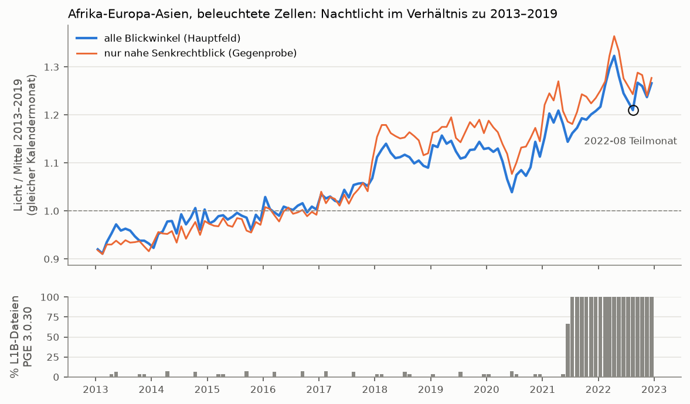
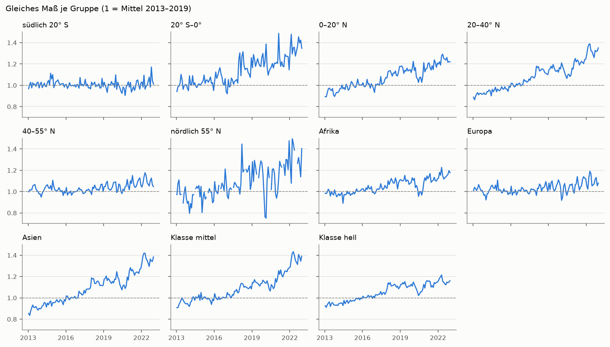
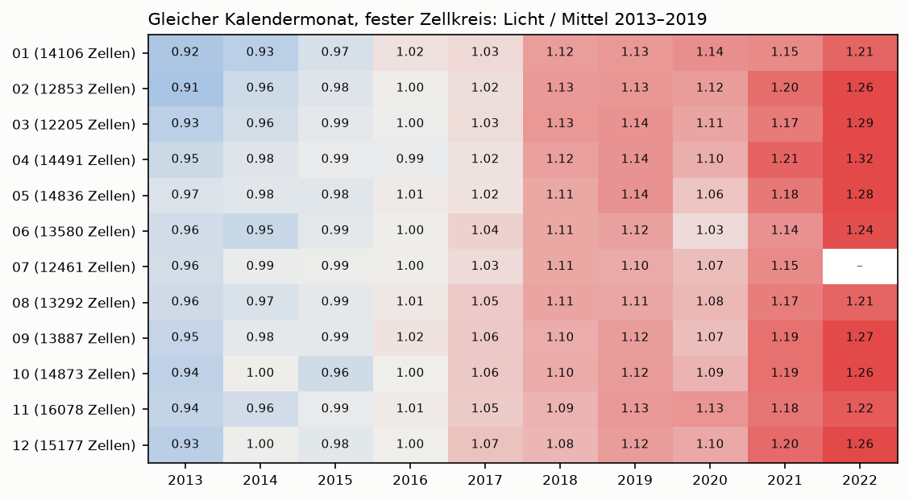
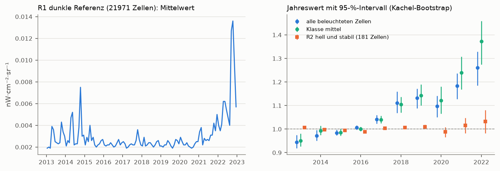
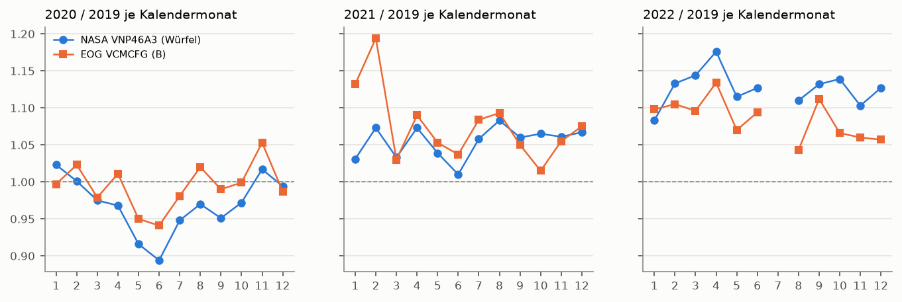

# Anstieg des Nachtlichts 2021–2022: Woher kommt er?

Stand: 2026-10-05 · abgeschlossen · Code: `aleph/diagnose/anstieg_2021_2022.py` (Regeln vorab committet in `9de5e42`) · Tests: `tests/test_diagnose_anstieg.py` · Ergebnisse auf der SSD: `auswertungen/anstieg_2021_2022/` · Grafiken: `berichte/bilder/2026-10-05_anstieg_*.png`

## Kurzfassung

- **2021: kein Hinweis auf einen Verarbeitungsfehler.** Der Anstieg erscheint auch in einer zweiten, teilweise unabhängig verarbeiteten Quelle desselben Sensors (EOG, Colorado School of Mines): +7,5 % gegen 2019, NASA +5,6 % (beobachtet). Am besten passt er zu Langzeitanstieg plus Erholung nach dem Tief 2020 (statistische Assoziation).
- **2022 steigt das NASA-Produkt 3–6 Prozentpunkte stärker als die unabhängige Quelle** (NASA +12,7 %, EOG +8,5 % gegen 2019). Woher dieser Rest kommt, ist **offen**.
- Es gab keinen Versionswechsel bei den Monatsdateien. Der Wechsel der NASA-Kalibriersoftware am 12.06.2021 erzeugt keine sichtbare Stufe.
- Der Anstieg ist nicht überall gleich: stark in Asien und in schwach beleuchteten Zellen, kaum in Europa und an hellen, stabilen Orten. Ein einheitlicher Kalibrierfaktor ist damit unwahrscheinlich.
- In ganz dunklen Wüstenzellen steigt der Grundwert 2022 deutlich. Der Verlauf ähnelt dem Sonnenzyklus. Das ist eine Spur, kein Beleg.
- Die „+10 % / +16 %“ (Median der Länder, Jahr gegen Vorjahr) überzeichnen: Sie messen ab dem Pandemiejahr 2020, und 2022 fehlen Juli und August.
- Regel für ALEPH: 2021 normal nutzen. 2022 in Trendaussagen kennzeichnen. Keine Korrektur, weil nichts belegt ist.
- statistik-pruefer: zunächst „nicht bestanden“ (eigener Methodenfehler, siehe Belege), Auflagen umgesetzt. plausibilitaets-pruefer: siehe Abschnitt Prüfer.

## Urteil

**Wahrscheinlichste Erklärung (Evidenzstufe je Teil):**

1. **2021: kein Hinweis auf einen Verarbeitungsfehler** – der Anstieg ist *beobachtet* in zwei Produkten mit verschiedenem Verfahren, aber vom **selben Sensor**. Ein Fehler am Gerät selbst (Alterung, Spektralantwort) wäre in beiden. Die Zerlegung unten ist eine Modellzerlegung (*statistische Assoziation*, keine reine Beobachtung):
   - dem Langzeitanstieg von etwa 3,6 % pro Jahr, den es schon 2013–2019 gab (*beobachtet*, fester Zellkreis 35° S–35° N);
   - der Erholung nach der Delle 2020: Mai/Juni 2020 lagen 8–11 % unter 2019, in beiden Quellen sichtbar (*beobachtet*; dass die Pandemie die Ursache ist, ist eine naheliegende Vermutung, nicht geprüft).
   - Ob dieses Mehr an Licht Wachstum, Elektrifizierung, LED-Umrüstung oder andere Ursachen hat, ist **nicht** geprüft.
2. **2022: Ein Teil ist echt, ein Rest von 3–6 Punkten ist unerklärt** – *beobachtet* als Unterschied zwischen NASA und EOG (95-%-Intervall des Unterschieds +2,7 bis +5,9 Punkte, nur räumliche Streuung erfasst).
   - Wer von beiden richtig liegt, lässt sich nicht sagen. EOG ist nicht „die Wahrheit“: anderes Verfahren, ohne Mond- und Winkelkorrektur.
   - Eine passende Spur, nicht belegt: Der Grundwert in völlig dunklen Wüstenzellen steigt 2022 (Anteil nicht-leerer Zellmonate 0,20 → 0,40). Er verläuft ähnlich wie die Sonnenfleckenzahl (*beschreibend, nachträglich, kein Test*). Das Handbuch rechnet das Eigenleuchten der Atmosphäre in mondlosen Nächten als festen Wert. Ob das den Rest bei beleuchteten Zellen erklärt, ist **offen** (*hypothetisch*).

**Was dagegen spricht, dass es ein reiner Kalibrierfehler ist:**
- Kein Versionswechsel der Monatsdateien. Alle Dateien 2013–2022: Collection 2, PGE 2.0.5, Jahr für Jahr im Frühjahr 2025 erzeugt (*beobachtet*, NASA-Katalog).
- Der Software-Wechsel der Rohkalibrierung (VNP02DNB 3.0.29 → 3.0.30 am 12.06.2021) passt nicht zu den Daten:
  - Das Modell mit diesem Wechsel ist nicht besser als ohne (*beobachtet*).
  - Das Verhältnis NASA/EOG zeigt dort keine Stufe (*beobachtet*).
- Helle, stabile Orte steigen kaum (+2,3 % 2022/2019 [−1,6; +6,6]), die Klasse hell +3,6 % [−1,0; +8,0]. Ein einheitlicher Faktor von +11 % ist dort unwahrscheinlich; einige Prozent sind nicht ausgeschlossen (*beobachtet*).
- Der Anstieg ist regional sehr verschieden (Asien stark, Europa schwach). Ein reiner Kalibrierfaktor wirkt überall gleich (*beobachtet*). **Aber:** Ein additiver Versatz (wie der Elektronik-Versatz vom Januar 2020 bei NOAA) trifft schwache Zellen stärker. Mit dem Muster „mittel stärker als hell, dunkle Wüste steigt“ ist er vereinbar.
- Feuer und Gasfackeln erklären den Rest 2022 nicht: EOG filtert sie nicht und müsste dann höher liegen, liegt 2022 aber tiefer.

**Was dafür spricht, dass 2022 ein Messanteil steckt:**
- der Unterschied NASA − EOG 2022 (*beobachtet*);
- der steigende Grundwert in dunklen Wüstenzellen 2022 (*beobachtet*; Ursache offen).

**Offen:**
- Ursache des Rests 2022.
- Ob das Eigenleuchten der Atmosphäre (Sonnenzyklus) Werte über der 0,5-Schwelle beeinflusst.
- Ob EOG eine eigene Kalibrierkette hat (die Seiten nennen die Rohdatenquelle nicht).
- Warum der Median der Länder 2022 +15,6 % zeigt (nicht nachgerechnet, siehe Nicht geprüft).

**Zurückgezogen:** Meine erste nachträgliche Aussage, „fast der ganze Anstieg geschieht an den Jahreswechseln“, war ein **Artefakt meiner Methode** (Befund des statistik-pruefers, mit Test bestätigt). Sie gilt nicht.

## Belege

### Teil 0 – Test auf main

- `tests/test_link_nachtlicht_einheiten.py::test_technikprobe_2018_01_echte_daten` erwartete fest „USA 2018-01 nicht geladen“. Seit 2018-01 vollständig geladen ist, schlug er fehl.
- Jetzt wie im worktree: Der Test liest den Zustand des Monats aus dem Würfel. Die Datei ist zeichengleich mit dem worktree (`diff` leer).
- Testsuite danach: 798 bestanden, 0 fehlgeschlagen, 0 übersprungen (8 min). Commit `c7cad2a`.

### Gemeinsame Grundlage

- **Fläche:** nur Afrika-Europa-Asien. Nur dort sind 2013–2022 alle Monate geladen (2013–2017 und 2021–2022 Zustand 4, 2018–2020 Zustand 1). 119 Monate, ohne 2022-07 (Safe Mode). 2022-08 ist ein Teilmonat.
- **Feld:** `allangle_mittel_beobachtet`. Ein Zellmonat ist gültig ab 50 % beobachteten Pixeln und ohne Schnee-Verdacht.
- **Regeln:** vorab festgelegt und committet (`9de5e42`), bevor ein Würfelwert gerechnet wurde. Danach nur:
  - ein Programmfehler behoben: Zeile und Spalte der Zuordnungstabelle sind 16-Bit-Zahlen, die Zellnummer lief über, kein Landanteil wurde gefunden; jetzt `zellschluessel` mit Test, Regeln unverändert;
  - als „nachträglich“ gekennzeichnete Zusätze.
- **Würfel ist über die Ladezustände stimmig** (technische Prüfung nach Hinweis des statistik-pruefers): Kandidat A (Earth Engine baut den Monatswert aus NASA-Tageswerten nach, ohne unseren Download) gegen den Würfel, Median A/Würfel:

  | Monat | Zustand | mittel | hell | Urteil K1–K6 |
  |---|---|---|---|---|
  | 2017-10 | 4 | 0,9990 | 0,9994 | erfüllt |
  | 2018-10 | 1 | 0,9988 | 0,9991 | erfüllt |
  | 2021-10 | 4 | 0,9988 | 0,9992 | erfüllt |

  Laden: je 188/188 Blöcke, 0 Fehler, 0 Wiederholungen (77 bzw. 72 min). Das prüft unsere Verarbeitung, nicht die Kalibrierung bei NASA (gleiche Tageswerte).

### Teil 1 – Form des Anstiegs

**Maß.** Je Zelle das Verhältnis zum Median desselben Kalendermonats 2013–2019, flächengewichtet je Gruppe gepoolt (1 = wie 2013–2019). Unsicherheit: Bootstrap über 10°-Kacheln. Er erfasst die räumliche Streuung, **nicht** Effekte, die alle Kacheln gemeinsam treffen (z. B. Kalibrierung), keine Unsicherheit der Basislinie und keine wechselnden Zellmengen.

**Jahreswerte** (*beobachtet*; Verhältnis gegen 2019 mit 95-%-Intervall):

| Gruppe | 2020/2019 | 2021/2019 | 2022/2019 |
|---|---|---|---|
| alle beleuchteten Zellen | 0,97 | 1,046 [1,022; 1,072] | 1,113 [1,073; 1,153] |
| Klasse mittel (0,5–5) | 0,98 | 1,084 [1,056; 1,108] | 1,202 [1,155; 1,244] |
| Klasse hell (≥ 5) | 0,97 | 1,015 [0,989; 1,046] | 1,036 [0,990; 1,080] |
| Asien | 0,98 | 1,071 [1,040; 1,107] | 1,170 [1,122; 1,229] |
| Europa | 0,96 | 1,020 [0,995; 1,048] | 1,037 [0,993; 1,088] |
| Afrika | 0,94 | 1,014 [0,964; 1,080] | 1,053 [0,980; 1,148] |
| 20–40° N | 0,97 | 1,060 [1,025; 1,103] | 1,153 [1,103; 1,203] |
| 40–55° N | 0,98 | 1,024 [1,000; 1,055] | 1,040 [0,992; 1,096] |
| südlich 20° S | 0,97 | 0,986 [0,932; 1,041] | 1,025 [0,954; 1,142] |

Ozeanien (1 162 Randzellen der Region, kaum Licht) ist reines Rauschen und nicht dargestellt. Der Blickwinkel spielt keine Rolle: Das Feld nur nahe Senkrechtblick steigt gleich (2022/2019 +10 %).

**Gleiche Kalendermonate** (fester Zellkreis je Kalendermonat, 12 000–16 000 Zellen; *beobachtet*): 2017 → 2018 steigt jeder Kalendermonat, um +1 % (Dezember) bis +10 % (Februar), in der ersten Jahreshälfte meist +7 bis +10 %. 2020 → 2021 sind es +1 bis +11 %, 2021 → 2022 +3 bis +10 %.

**Pandemie 2020** (*beobachtet*):
- Feste Zellkreise, 2020 gegen 2019: Mai −8,4 %, Juni −10,6 % (Würfel), bei EOG −5,0 % und −5,9 %.
- Jahreswert 2020/2019: −3 % (alle), −6 % Afrika.
- 2021 liegt also zu einem guten Teil „über einem Tief“. Ein Vergleich Jahr gegen Vorjahr ab 2020 überzeichnet den Anstieg.

**Sprung oder schleichend?**
- Das Statistik-Gerüst hat **keinen** Bruchpunkt-Test. Verwendet wurde ein BIC-Vergleich mit einem Block-Bootstrap für die Lage der Stufe.
- **Ergebnis der vorab festgelegten Fassung:** M_jan (Stufen Jan. 2021/Jan. 2022) vor M_stufe (2021-11) vor M_knick vor M_l1b vor M0.
- **Das ist nicht verwertbar** (statistik-pruefer, Befund 1–2): Die Basislinie „Median desselben Kalendermonats“ macht aus jedem gleichmäßigen Anstieg eine Treppe mit Stufen im Januar. Das ist im Test `test_basislinie_macht_aus_stetigem_anstieg_eine_treppe` gezeigt. Damit begünstigt sie M_jan von vornherein.
- **Lage einer Einzelstufe:** nicht eingrenzbar (90-%-Bereich 2014-09 bis 2021-11).
- **Nachträglich, artefaktfrei** (fester Kreis von 4 607 Zellen zwischen 35° S und 35° N, in allen 118 Monaten gültig, Jahreszeit mitgeschätzt; `ergebnis_panel.json`):

  | Modell | BIC | Wirkung |
  |---|---|---|
  | M0 Trend + Jahreszeit | −723,6 | +3,6 % pro Jahr |
  | M_l1b (Software-Wechsel 12.06.2021) | −723,1 | +2,5 %, verbessert nichts |
  | M_knick (bester: 2021-07) | −723,8 | praktisch gleich M0 |
  | M_jan (Jan. 2021 / Jan. 2022) | −726,7 | 0,0 % / +4,8 %, schwach |
  | M_stufe (bester: 2019-07) | −756,4 | −7 %: bildet 2018 hoch, 2020 tief ab |

  Abweichung vom Trend je Jahr: 2017 +1,0 %, **2018 +4,9 %**, 2019 +0,9 %, **2020 −6,5 %**, 2021 −1,2 %, **2022 +3,2 %**. 2021 liegt im Rahmen des Langzeitbilds, 2022 so weit darüber wie 2018.
- **Grundsätzliche Grenze:** Ob das Licht innerhalb eines Jahres wächst oder nur von Jahr zu Jahr springt, lässt sich bei frei geschätzter Jahreszeit **nicht** bestimmen (die Rampe innerhalb des Jahres geht in die Monatseffekte auf). Bestimmbar ist nur eine einmalige Stufe gegenüber einem durchgehenden Trend.

### Teil 2 – Herkunft der Dateien

**2.1 Monatsdateien** (NASA-Katalog CMR, abgerufen 2026-10-05, öffentlich; Zeitlimit 90 s, 4 Versuche, 10/20/40 s Pause; keine Wiederholung nötig):
- Alle 188 Kacheln der Region in allen Monaten 2013–2022: Collection 2, PGE **2.0.5**.
- Unsere Manifest-Dateinamen sind in jedem Monat genau die heutigen Katalogdateien.
- **Erzeugung Jahr für Jahr im Frühjahr 2025:**

  | Daten aus | Hauptlauf erzeugt |
  |---|---|
  | 2013 | 28.03.2025 |
  | 2018 | 23.04.2025 |
  | 2019/2020 | 13.05.2025 |
  | 2021 | 27./28.05.2025 |
  | 2022 | 04.06.2025 |

  Je Monat wurden 1 bzw. 9 Kacheln später neu erzeugt (immer dieselbe h34v01 bzw. dieselben neun, Arktis/Ränder).
- **Kein Wechsel, der zum Anstieg passt.**

**Eingangsdaten** (gleiche Quelle; für VNP02DNB alle 3 652 Tage 2013–2022 abgefragt, je Tag rund 241 Dateien; `l1b_versionen.json`):

| Produkt | bis 11.06.2021 | ab 12.06.2021 |
|---|---|---|
| VNP02DNB (kalibrierte Rohstrahldichte, Grundlage von Black Marble laut Handbuch-Anhang) | PGE 3.0.28/3.0.29, erzeugt Dez. 2020 – Juni 2021; an 1–2 Tagen je Monat schon 3.0.30 (höchstens 7 %) | **PGE 3.0.30**, erzeugt ab Sept. 2022 (100 %) |
| VNP46A1 (Stichprobe am 15., Kachel h20v05) | 2.0.7 (2013) / 2.0.12, erzeugt 2024 | 2.0.12, erzeugt 2024 |
| VNP46A2 (Stichprobe wie oben) | 2.0.4 / 2.0.5, erzeugt Juli 2024 – März 2025 | 2.0.5, erzeugt April–Mai 2025 |

Was sich bei 3.0.30 inhaltlich ändert, steht nirgends, was ich gelesen habe. Messbar ist nur: keine Stufe in den Daten (Teil 1, Teil 4).

**2.2 NASA-Dokumentation** (selbst im Originaltext gelesen, abgerufen 2026-10-05, Text aus HTML bzw. PDF mit pypdf, keine Zusammenfassung durch ein Hilfsmodell):

- **LAADS-Produktseite VNP46A3** (https://ladsweb.modaps.eosdis.nasa.gov/missions-and-measurements/products/VNP46A3/): „The SNPP DNB experienced degradation after launch … In v2.0, the yearly DNB spectral response functions are applied to the SNPP Black Marble product.“ Kein Hinweis auf Probleme 2021/2022.
- **Black Marble User Guide Collection 2.0** (https://viirsland.gsfc.nasa.gov/PDF/BlackMarbleUserGuide_Collection2.0.pdf, 64 Seiten):
  - nichts zu Änderungen 2021/2022;
  - Abschnitt 2.3, S. 5: „during moon-free nights, when atmospheric airglow is the dominant emission source, the VNP46 algorithm sets the illumination geometry to near-nadir … and the lunar irradiance to Em(Λ) = 0.26 nW·m−2“, also ein **fester** Wert;
  - S. 6: Kompositwerte unter 0,5 nW·cm⁻²·sr⁻¹ werden auf 0 gesetzt;
  - Anhang: Black Marble beruht auf VNP02DNB.002.
- **NOAA/SPIE 2021** (Gu et al., „Restoration of Degraded Suomi-NPP VIIRS DNB Nighttime Imagery Induced by Electronic Bias Change“, Proc. SPIE 11829, 118290V, doi 10.1117/12.2593739; https://repository.library.noaa.gov/view/noaa/69116):
  - Elektronik-Versatz nach einem Software-Update am 8. Januar 2020;
  - betrifft die NOAA-Kalibriertabellen, behoben ab Ende Januar 2020;
  - **nicht** 2021/2022.
- **MODAPS-Ausfallliste Suomi NPP** (https://modaps.modaps.eosdis.nasa.gov/services/production/outages_suomi_npp.html, Stand 5.10.2026):
  - 2021: Manöver 24.01., 14.10., 18.11.; Safe Mode 3./4.08.;
  - 2022: Lock-up 26.07.–11.08.;
  - nur kurze Ausfälle, nichts zur Kalibrierung.
- **Bahn:** Eine Bahnänderung 2021/2022 ist **nicht belegt**. Die CISESS-Kurzfassung (https://cisess.umd.edu/assets/1/7/Xi_Shao_1.pdf) sagt nur allgemein, dass die Überflugzeit driftet und regelmäßig korrigiert wird.
- **EOG:** Die EOG-Seite (https://eogdata.mines.edu/products/vnl/) und die Earth-Engine-Katalogseite nennen die Rohdaten-Kalibrierung von VCMCFG nicht. Ein zweiter Abruf der EOG-Seite scheiterte am Zertifikat; die Prüfung wurde nicht abgeschaltet.

### Teil 3 – Orte, die sich nicht ändern sollten

Die Regeln standen vor dem Rechnen fest (Modulkopf, Commit `9de5e42`).

- **R1 dunkle Referenz:** 21 971 Landzellen zwischen 15° und 35° Breite, jeder Wert 2013–2019 < 0,1 (*beobachtet*):

  | | 2013 | 2014 | 2015 | 2016–2019 | 2020 | 2021 | 2022 |
  |---|---|---|---|---|---|---|---|
  | Mittel (nW) | 0,0028 | 0,0034 | 0,0026 | 0,0023–0,0024 | 0,0023 | 0,0032 | 0,0068 |
  | Anteil Zellmonate > 0 | 0,29 | 0,34 | 0,28 | 0,22–0,24 | 0,20 | 0,23 | 0,40 |

  - Der Anstieg beginnt allmählich ab etwa 2021-08, mit Spitzen 2022-04/05 und 2022-09/10.
  - **Grenzen:** Die Werte sind winzig, denn NASA setzt Pixel unter 0,5 auf 0; ein kleiner Versatz bleibt so unsichtbar. Die Auswahl begrenzt nur 2013–2019, spätere Jahre können deshalb nur nach oben abweichen. 2020 ist aber unauffällig.
- **Sonnenzyklus** (*nachträglich, beschreibend, kein Test*):
  - Der **Anteil der Zellmonate > 0** verläuft ähnlich wie die Jahresmittel der Sonnenfleckenzahl (SILSO, https://www.sidc.be/SILSO/INFO/snmtotcsv.php, abgerufen 2026-10-05: 2014 114, 2019 4, 2022 83). Rangkorrelation 0,88 über 10 Jahreswerte eines einzigen Zyklus.
  - 2022 passt nicht ganz: Anteil 0,40 bei 83, aber 2013 nur 0,29 bei 94.
  - Literatur, im Volltext gelesen: Grauer et al. 2021, Scientific Reports 11:23893, doi 10.1038/s41598-021-02365-1 (https://pmc.ncbi.nlm.nih.gov/articles/PMC8669019/), „Astronomers have recognized that broadband night sky brightness has, diurnal, semi-annual, solar cycle variations“, mit Verweis auf frühere Arbeiten. Die dort zitierten Originale habe ich nicht gelesen.
- **R2 helle, stabile Orte:** Hauptregel, 181 Zellen; 116 in Europa, 48 in Asien, 15 in Afrika (*beobachtet*):
  - 2021/2019 +0,6 % [−2,0; +3,1], 2022/2019 +2,3 % [−1,6; +6,6].
  - Richtiger Vergleich ist die **Klasse hell** (+1,5 % / +3,6 % [−1,0; +8,0]); die Intervalle überlappen.
  - Gedeckt ist: Ein einheitlicher Faktor von +11 % ist an hellen, stabilen Orten unwahrscheinlich. Wenige Prozent sind nicht ausgeschlossen.
  - Asien ist durch R2 kaum abgedeckt. Die Auswahl „kein Wachstum 2013–2019“ legt geringen späteren Anstieg teilweise schon an.
- **„mittel steigt stärker als hell“ beweist keinen Versatz** (Befund 7 des Prüfers): Auch ein reiner Faktor schiebt Pixel über die 0,5-Schwelle. Außerdem liegen mittlere Zellen überwiegend in Wachstumsregionen.

### Teil 4 – Unabhängige Gegenprobe B (EOG VCMCFG über Earth Engine)

- **Geladen:** 47 Monate 2019-01 bis 2022-12 ohne 2022-07, je 188 Blöcke. 0 gescheiterte Monate, Zeitlimit 600 s je Anfrage, Wiederholungsregel aus `ee_nachtlicht.py`.
- **Zellen:** südlich 60° N, ≥ 50 % Land, Klassen mittel und hell, beide Quellen gültig; je Kalendermonat ein fester Kreis (5 344–12 294 Zellen; Grundmenge 12 730).
- **Ergebnis, gepoolt ohne Juli** (*beobachtet*):

  | gegen 2019 | Würfel | B | Würfel − B (95 %) | Urteil (vorab festgelegt) |
  |---|---|---|---|---|
  | 2020 | 0,976 [0,959; 0,993] | 0,999 [0,985; 1,014] | −3,3 bis −1,2 Punkte | – |
  | 2021 | 1,056 [1,031; 1,086] | 1,075 [1,051; 1,103] | −3,4 bis −0,7 | **B zeigt denselben Anstieg** |
  | 2022 | 1,127 [1,085; 1,171] | 1,085 [1,045; 1,121] | **+2,7 bis +5,9** | **B zeigt denselben Anstieg** (knapp: 0,67 des Würfel-Anstiegs, Grenze 2/3) |

- **Nachträglich:** das Verhältnis B/Würfel je Monat (gleiche Zellen).
  - Am Software-Wechsel 12.06.2021 keine Stufe: Juni–Dezember 2021 ähnlich wie 2019.
  - Ab Februar 2022 liegt das Verhältnis tiefer als in denselben Monaten 2019, um etwa 2–8 Punkte, am stärksten im August und Oktober 2022.
  - Januar/Februar 2021 ist B auffällig hoch (+13 %/+19 % gegen 2019), Ursache nicht geprüft.
- **Grenzen von B:**
  - keine Mond- und Winkelkorrektur, keine Schneetrennung;
  - Boote und Feuer werden nicht herausgefiltert (deshalb nur Land und beleuchtete Zellen);
  - im Norden lückenhaft (deshalb nur südlich 60° N);
  - ob B eine eigene Kalibrierkette hat, ist **nicht belegt**. Gleicher Satellit, also keine Prüfung des Sensors selbst.

- **Energiekrise Europa 2022** (*nachträglich, beschreibend*, Hinweis plausibilitaets-pruefer). Europa südlich 60° N, Klassen mittel und hell, gleiche Monate gegen 2019:

  | | Sep | Okt | Nov | Dez |
  |---|---|---|---|---|
  | Würfel 2021 | +3,4 % | +4,4 % | +4,2 % | +2,7 % |
  | Würfel 2022 | +1,5 % | +3,5 % | −0,1 % | −0,3 % |
  | B 2022 | −1,7 % | −3,5 % | +4,7 % | −10,0 % |

  - Eine schwache Abdunkelung gegenüber 2021 ist im Würfel sichtbar (−1 bis −4 Punkte). B ist teils deutlicher.
  - Mai bis Juli: zu wenige Zellen (helle Nordsommernächte).
  - Dass Gemeinden die Beleuchtung abgeschaltet haben, ist hier nicht geprüft.

### Prüfer

- **statistik-pruefer** (Teil 1 und 3): „nicht bestanden“ für die Jahreswechsel-Aussage und die Deutung von M_jan, sonst mit Auflagen. Umgesetzt:
  - Aussage zurückgezogen, Artefakt per Test gezeigt;
  - artefaktfreie Gegenrechnung (fester Zellkreis, Jahreszeit mitgeschätzt);
  - Ladezustand geprüft (Kandidat A in drei Monaten);
  - R2 gegen Klasse hell, Europa-Schwerpunkt genannt;
  - Nullsetzung und Auswahleffekt bei R1 und der Klasse mittel genannt;
  - Sonnenzyklus-Satz korrigiert (Anteil > 0, beschreibend);
  - Evidenzstufen ergänzt;
  - Pandemie getrennt ausgewiesen.
  - Nicht umgesetzt: eine Bootstrap-Lage um das beste Modell (das vorab gewählte Verfahren ist nicht verwertbar, siehe oben).
- **plausibilitaets-pruefer** (Urteil): **„plausibel mit Vorbehalt“.** Die Richtung passt zu bekannten Befunden (Delle 2020 in China und Indien, Europa flach bis dunkler); diese kennt er nur aus Suchergebnissen. Umgesetzt:
  - Kurzfassung und Urteil abgeschwächt („kein Hinweis auf Verarbeitungsfehler“, „gleicher Sensor“);
  - Zerlegung als statistische Assoziation;
  - Versatz-Satz und Feuer-Argument;
  - Lücke 2022 ab Februar;
  - Energiekrise Europa geprüft.
  - **Nicht behaupten** (Präsentation):
    - „Der Anstieg 2021/2022 ist echtes Wachstum“;
    - „2021 ist bewiesen kein Messfehler“ oder „unabhängig bestätigt“ ohne „gleicher Sensor“;
    - „NASA überschätzt 2022 um 3–6 %“ (offen, wer richtig liegt);
    - „Der Sonnenzyklus erklärt 2022“;
    - „Die Pandemie verursachte die Delle 2020“ als geprüfte Ursache;
    - „Nachtlicht stieg 2021 um 10 % und 2022 um 16 %“;
    - Aussagen zu Europa in der Energiekrise über das Beschriebene hinaus;
    - LED oder Elektrifizierung als Ursache.

## Umfang

- **~/ALEPH, neu:**
  - `aleph/diagnose/__init__.py`, `aleph/diagnose/anstieg_2021_2022.py`;
  - `tests/test_diagnose_anstieg.py` (19 Tests);
  - dieser Bericht und 5 Grafiken.
- **~/ALEPH, geändert:** `tests/test_link_nachtlicht_einheiten.py` (Teil 0), `LOG.md`.
- **SSD:**
  - neu `auswertungen/anstieg_2021_2022/` (Stapel 119 Monate × 300 800 Zellen, Ergebnisdateien, Katalogauszug `l1b_versionen.json`, SILSO-Datei);
  - neu `vergleich/earth_engine/` B 2019–2022 (47 Monate) und A 2017-10, 2021-10;
  - Würfel nur gelesen.
- **Netz:** NASA CMR (rund 3 900 Anfragen, 0 Wiederholungen), Earth Engine (49 Monatsläufe), LAADS-, MODAPS-, NOAA-, PMC- und SILSO-Seiten. Alle mit Zeitlimit und Wiederholungsregel (benannte Konstanten in `scripts/anstieg_2021_2022/` bzw. `ee_nachtlicht.py`). Die Katalogskripte liefen aus einem Arbeitsordner und liegen jetzt als Kopie in `scripts/anstieg_2021_2022/`.
- **Nicht angefasst:**
  - Nachtlicht-Download (Prozess 82367 läuft weiter);
  - `vnp46a3*.py`, Kachellisten, `scripts/vnp46a3_*`, `.env`.
  - Im Rohdatenordner nichts geöffnet.
- **Zeiträume:** keine Daten ab 2023 gelesen oder ausgewertet. Die Katalogabfragen endeten am 2022-12-31. Die Module verweigern Monate ab 2023 (Test).

## Empfehlung

**Regel für ALEPH, bis die Ursache des Rests 2022 geklärt ist:**

1. **2021 normal verwenden.** Bei Vergleichen mit 2020 immer dazuschreiben: „2020 ist ein Tiefjahr (Pandemie)“. Zum Vergleich 2019 nehmen.
2. **2022 in Trend- und Ländervergleichen kennzeichnen:**
   - Text: „NASA-Wert 2022 im Mittel 3–6 % höher als eine unabhängige Quelle; Ursache offen“.
   - Anstiege unter etwa 6 % zwischen 2021 und 2022 nicht als Veränderung deuten.
   - Nicht ausschließen und **nicht korrigieren**, denn eine Korrektur ist nicht belegt.
3. **Dunkle und schwach beleuchtete Zellen 2022** (Klasse dunkel, untere Klasse mittel) bei Erkennung und Trend mit dem Hinweis „Grundwert 2022 erhöht“ versehen.
4. **Keine Ländervergleiche „Jahr gegen Vorjahr“ aus Jahresmitteln mit unterschiedlichen Monaten.** 2022 fehlen Juli und August. Stattdessen gleiche Monate oder fester Zellkreis.
5. **Methodenwarnung für ALEPH:** Ein Vergleich mit dem Median desselben Kalendermonats über einen festen Basiszeitraum macht aus jedem Trend Stufen im Januar. Das betrifft auch Trendbilder, die so gebaut sind. Für Trend- oder Bruchfragen die Jahreszeit gemeinsam mit dem Trend schätzen.
6. **Oberfläche (worktree):** Der Warntext „Nicht als Wachstum deuten“ trifft 2021 nicht mehr genau. Vorschlag: „2021 höher als 2020, auch in einer unabhängigen Quelle; 2020 war ein Tiefjahr. 2022 im NASA-Produkt einige Prozent höher als in der Vergleichsquelle, Ursache offen.“ Nicht umgesetzt, weil das nicht Teil des Auftrags war.

**Nächste Schritte, falls geklärt werden soll:**
- NASA Black-Marble-Team bzw. LAADS fragen: Änderungen von VNP02DNB 3.0.30 gegenüber 3.0.29? Wie gilt die jährliche Spektralantwort für 2022?
- NOAA-20-Produkt VJ146A3 (eigener Sensor) für 2019–2022 in denselben Zellen vergleichen. Das prüft den Sensor selbst, braucht aber einen eigenen Download.
- Den Rest 2022 nach Sonnenzyklus und Mondphase aufschlüsseln.

## Nicht geprüft

- Inhalt der Änderung VNP02DNB 3.0.29 → 3.0.30 (keine Dokumentation gefunden).
- Ob das Eigenleuchten der Atmosphäre die beleuchteten Zellen merklich beeinflusst; die zitierten Originalquellen zu Airglow und Sonnenzyklus (nur Grauer et al. 2021 gelesen).
- Rohdatenquelle und Kalibrierung von EOG VCMCFG; Ursache der hohen B-Werte Januar/Februar 2021.
- Warum der Median der Länder (Globus-Bericht) 2021 +9,8 % und 2022 +15,6 % zeigt. Vermutlich wirken Pandemie-Basis, fehlende Sommermonate 2022 und Mediane über kleine Länder zusammen; nicht nachgerechnet.
- Regionen außerhalb Afrika-Europa-Asien (2021–2022 dort noch nicht geladen).
- Ob der Schritt 2017 → 2018 (+1 bis +10 % je Kalendermonat) eine Ursache bei NASA hat. Unser Würfel ist dort stimmig (Kandidat A); in B nicht prüfbar (erst ab 2019 geladen).
- VNP46A1/A2 nur stichprobenhaft (ein Tag, eine Kachel je Monat).
- Bahnänderungen von Suomi NPP 2021/2022 (keine belegte Angabe gefunden).
- Mondphasen-Verteilung je Monat als Ursache des Rests 2022.
- Gegenläufige Ereignisse 2022 (Lockdown Shanghai April/Mai 2022, Stromkrisen in Südasien): Der Prüfer weist darauf hin, dass April 2022 der höchste NASA-Monat ist. Nicht nachgerechnet.
- Die vom plausibilitaets-pruefer genannte NASA-Meldung zu einer Black-Marble-Studie 2014–2022 (nur über eine Zusammenfassung gesehen, nicht im Original).
